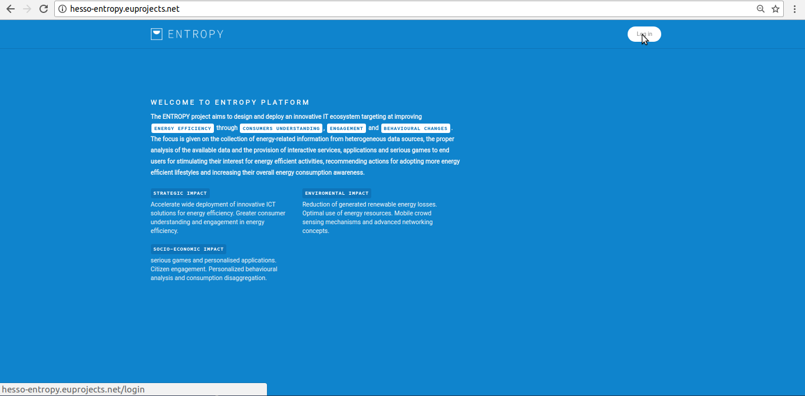
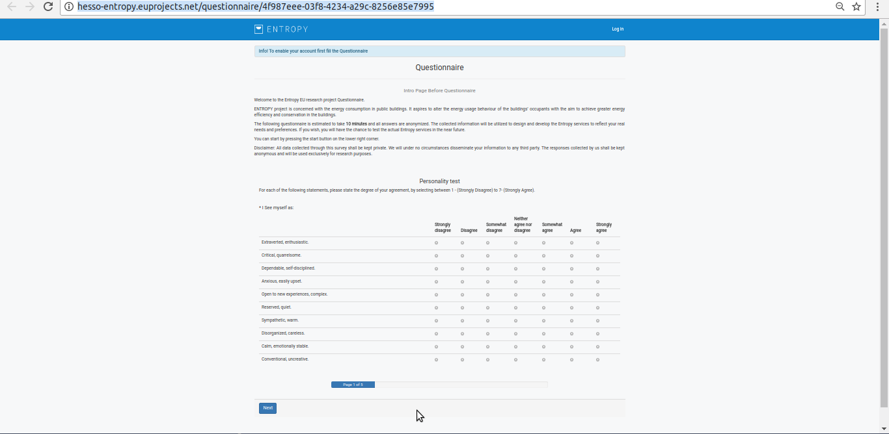

Entropy walkthrough
========

Create Account
--------

- When a user access the MITIGATE site (https://http://hesso-entropy.euprojects.net//) the following screen is shown:

.. image:: https://user-images.githubusercontent.com/17601358/33116585-02a8fe8e-cf6e-11e7-80e2-bcf7a1c68ae1.png

- Create account

- step 2

.. image:: assets/ENTROPY_cracc_3.png

- step 3

.. image:: assets/ENTROPY_cracc_4.png

- step 4

.. image:: assets/ENTROPY_cracc_5.png

- step 5

- Step 6

Login
------------

- When a user access the MITIGATE site (https://http://hesso-entropy.euprojects.net//) the following screen is shown:

.. image:: https://user-images.githubusercontent.com/17601358/33116585-02a8fe8e-cf6e-11e7-80e2-bcf7a1c68ae1.png

- Click the <Log in> button .

- Provide your login credentials and click the <SIGN IN> button.

.. image:: assets/Log_3.png

- Upon successful authentication the following screen will be presented.

.. image:: assets/Log_4.png

Logout
----------

- In order to perform logout  click the <Log-out > Button.

.. image:: assets/logout.png

- Upon successful logout the following screen will be presented.

.. image:: assets/logout_2.png

Reset password
-------

Support
-------

If you are having issues, please do not hesitate to contact us (pgouvas@gmail.com).
