Entropy walkthrough
========

Create Account
--------

- When a user access the ENTROPY site (https://http://hesso-entropy.euprojects.net//) the following screen is shown:

.. image:: https://user-images.githubusercontent.com/17601358/33116585-02a8fe8e-cf6e-11e7-80e2-bcf7a1c68ae1.png

- Create account

.. image:: assets/ENTROPY_log_2.png

- step 2

.. image:: assets/ENTROPY_cracc_3.png

- step 3

.. image:: assets/ENTROPY_cracc_4.png

- step 4

.. image:: assets/ENTROPY_cracc_5.png

- step 5

.. image:: assets/ENTROPY_cracc_6.png

- Step 6

Login
------------

- When a user access the ENTROPY site (https://http://hesso-entropy.euprojects.net//) the following screen is shown:

.. image:: https://user-images.githubusercontent.com/17601358/33116585-02a8fe8e-cf6e-11e7-80e2-bcf7a1c68ae1.png

- Click the <Log in> button .

.. image:: assets/ENTROPY_log_2.png

- Provide your login credentials and click the <SIGN IN> button.

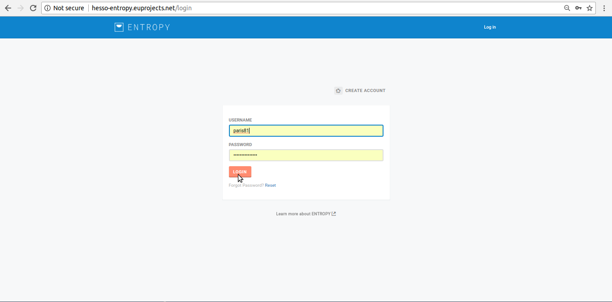

- Upon successful authentication the following screen will be presented.

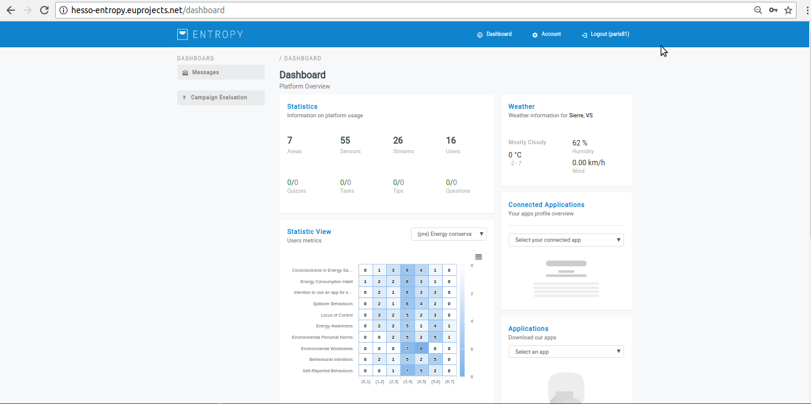

Logout
----------

- In order to perform logout  click the <Log-out > Button.

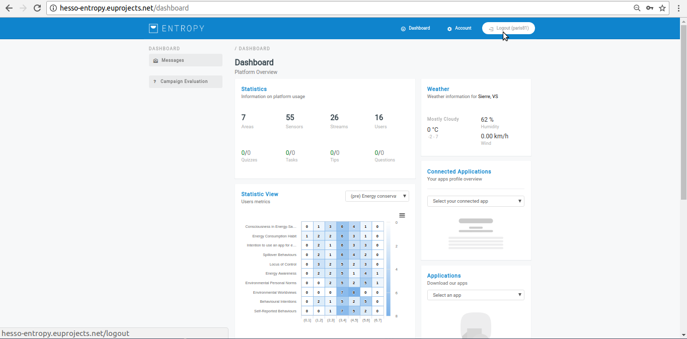

- Upon successful logout the following screen will be presented.

.. image:: https://user-images.githubusercontent.com/17601358/33116585-02a8fe8e-cf6e-11e7-80e2-bcf7a1c68ae1.png

Reset password
-------
- In order to reset our existing password click the Reset Button.

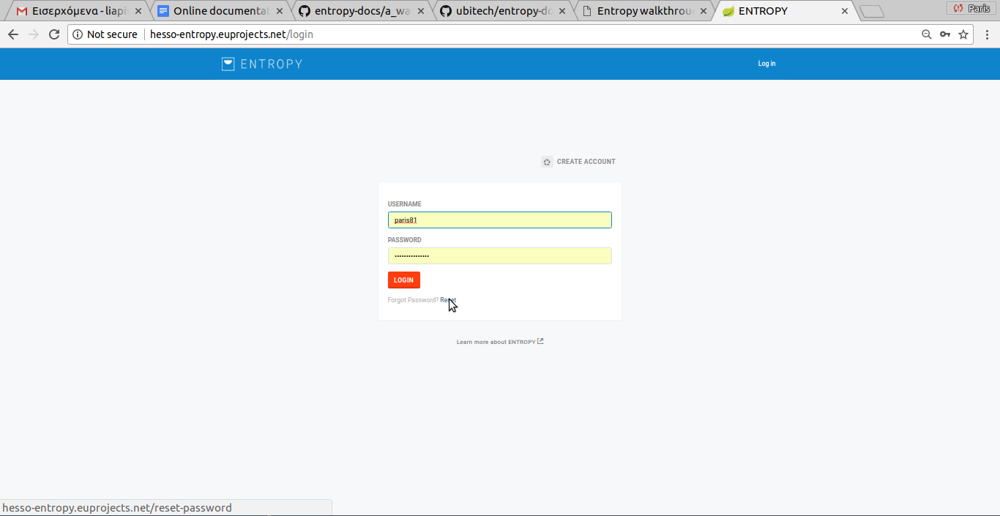

- Step 2

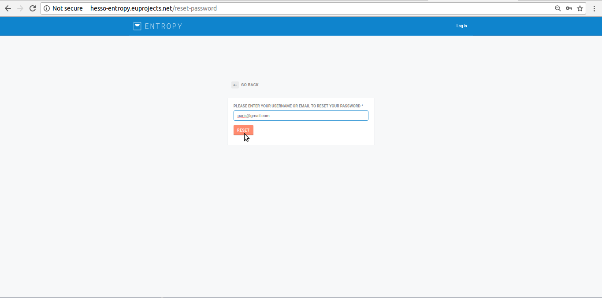

- Step 3

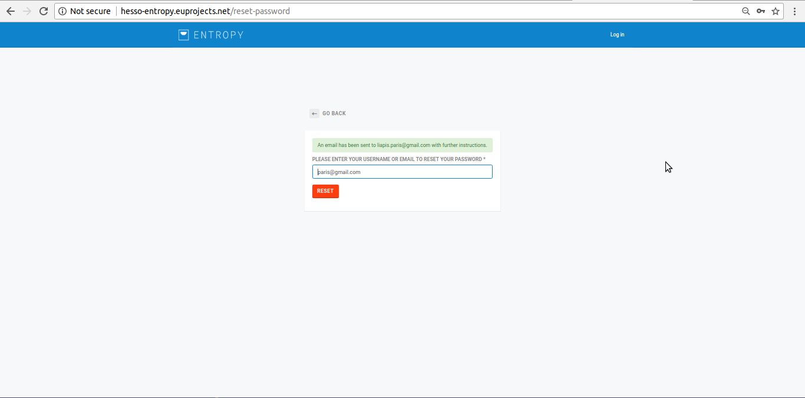

- Step 4

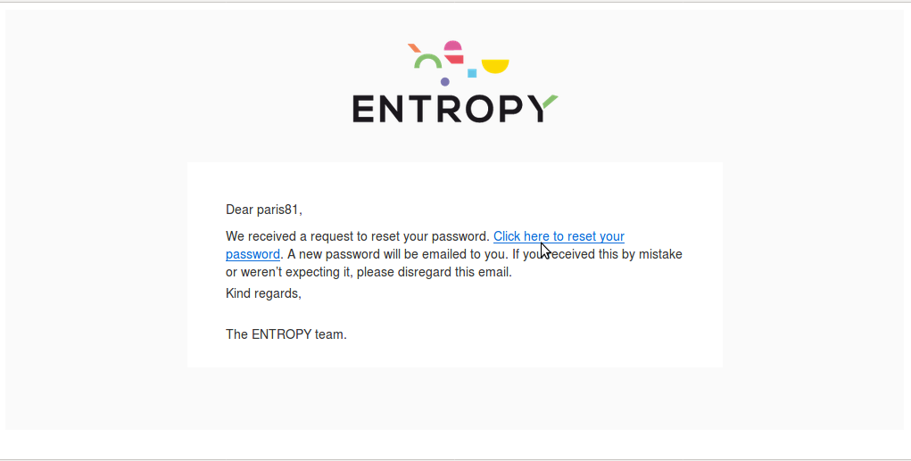

- Step 5

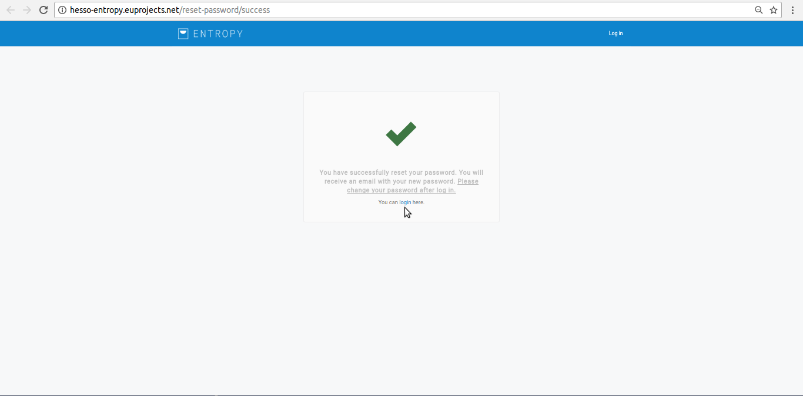

- Step 6

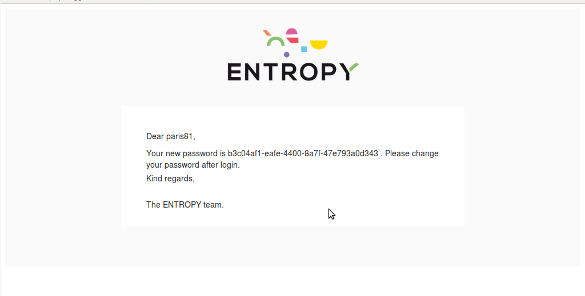

- Step 7

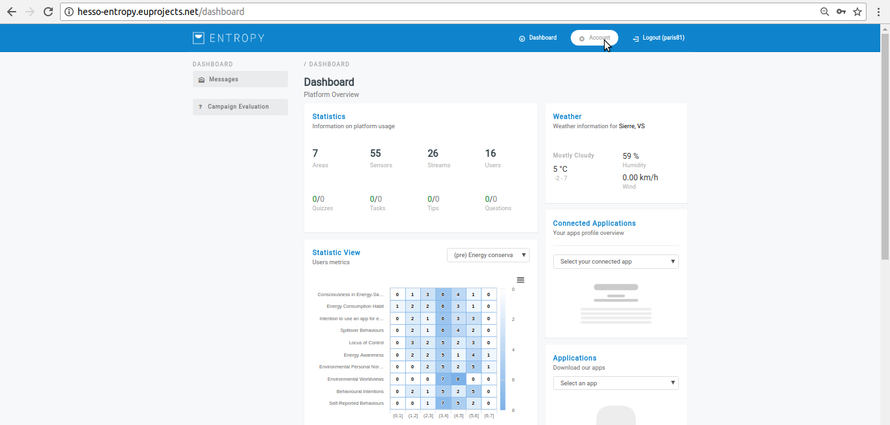

- Step 8

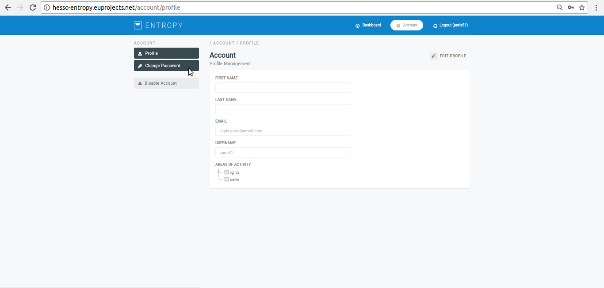

- Step 9

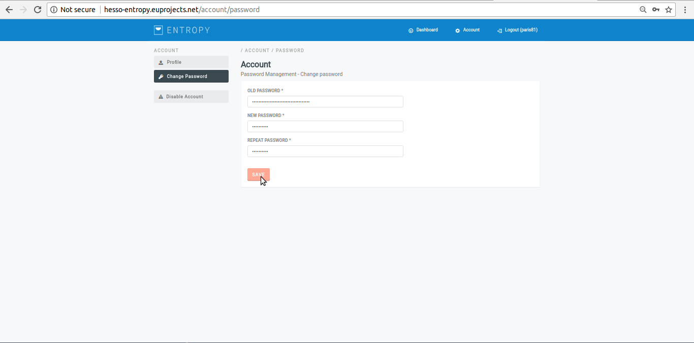

