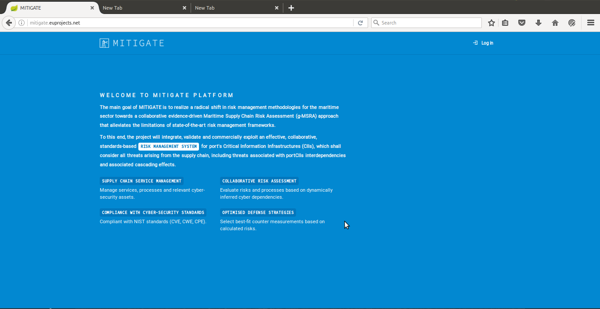
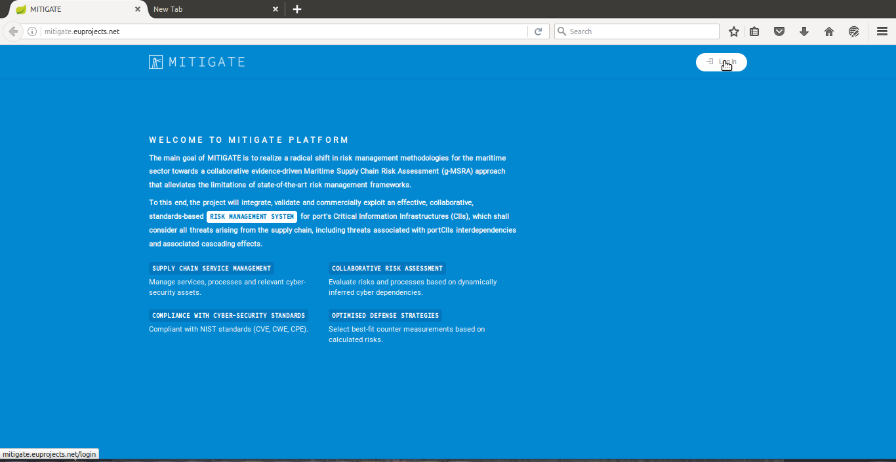
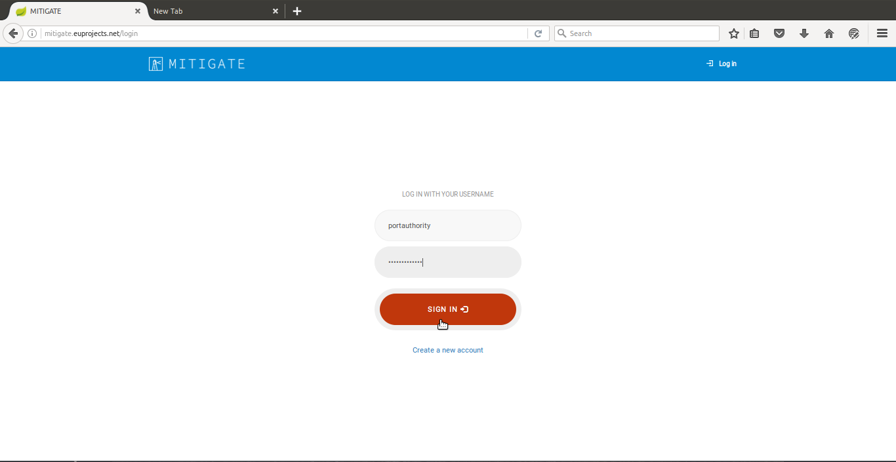
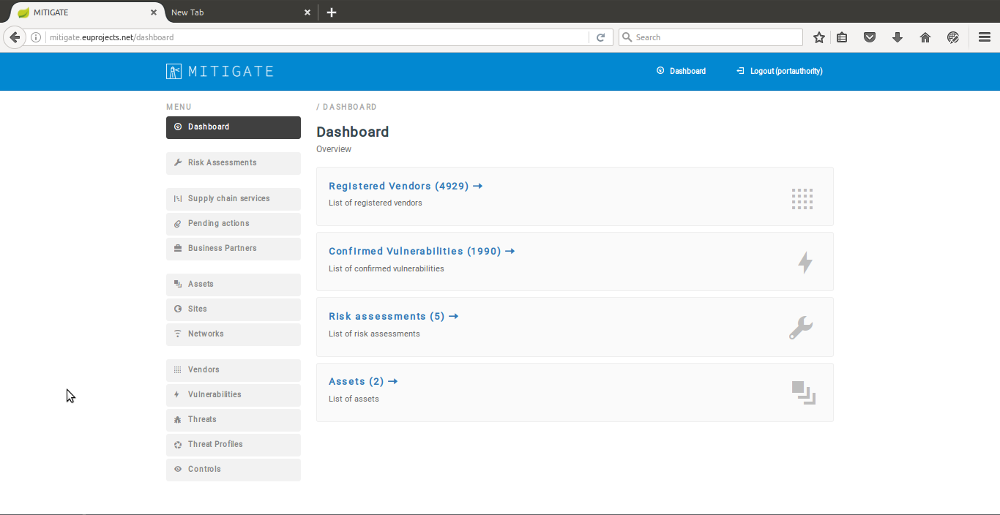

Entropy walkthrough
========

Create Account
--------

- When a user access the MITIGATE site (https://http://hesso-entropy.euprojects.net//) the following screen is shown:

(https://user-images.githubusercontent.com/17601358/33020750-0db4f2fe-ce08-11e7-8785-3f8dd7d6d285.png)

- Create account

Login
------------

- When a user access the MITIGATE site (https://http://hesso-entropy.euprojects.net//) the following screen is shown:

- Click the <Log in> button .

- Provide your login credentials and click the <SIGN IN> button.

- Upon successful authentication the following screen will be presented.

Logout
----------

- In order to perform logout  click the <Log-out > Button.

.. image:: assets/logout.png

- Upon successful logout the following screen will be presented.

.. image:: assets/logout_2.png

Reset password
-------

Support
-------

If you are having issues, please do not hesitate to contact us (pgouvas@gmail.com).
