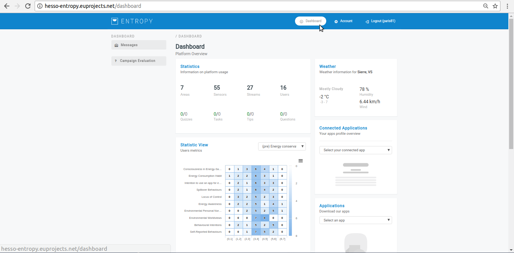

========
Dashboard
========

Campaign Manager Dashboard
--------
- Initially the user must login using the Campaign manager Credentials.
- Click on Dashboard button to review it.
- Dashboard includes sever information such as an overall view of registered sensors, areas , streams etc, local weather conditions, connected consumption apps.
- In case there is an active campaign, Dashboard also informs about the responsiveness of the users to the generated recommendations.

.. image:: assets/dashboardActiveCampaign.png

- Within a dropdown menu the Admin or Campaign manager can see some area statistics for the last 25 hours regarding the temperature and consuption of each registered building/area.

.. image:: assets/dashboardAreaStatistics.png

- Within a dropdown menu the Admin or Campaign manager can see the cooling/heating degree days as well as the relevant energy waste per area. 

.. image:: assets/dashboardDegreeDays.png

End User Dashboard
--------
- Initially the user must login using the End User Credentials.
- Click on Dashboard button to review it. The End User has limited access (messages, campaign evaluation)

