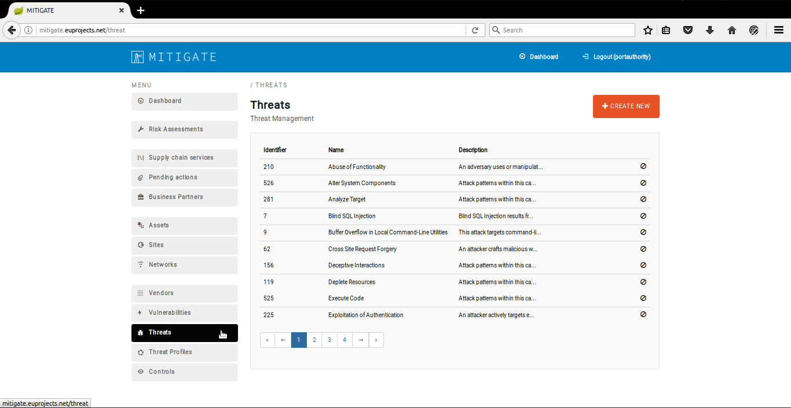
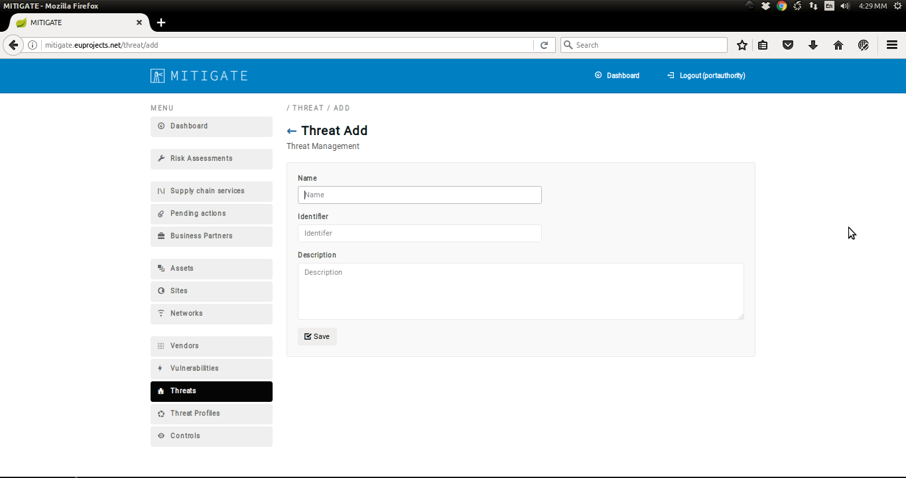
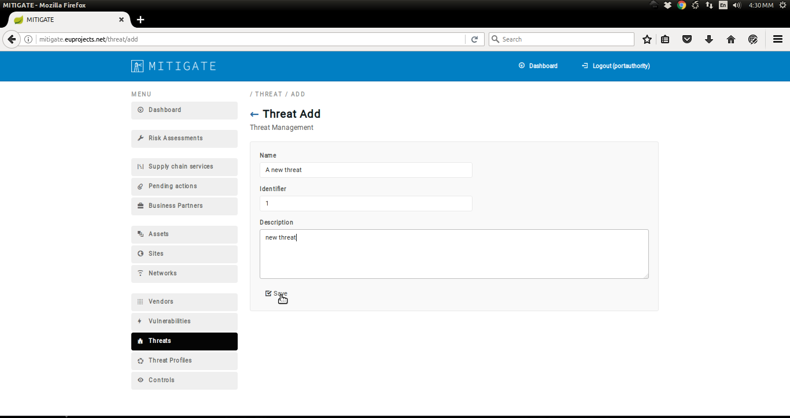
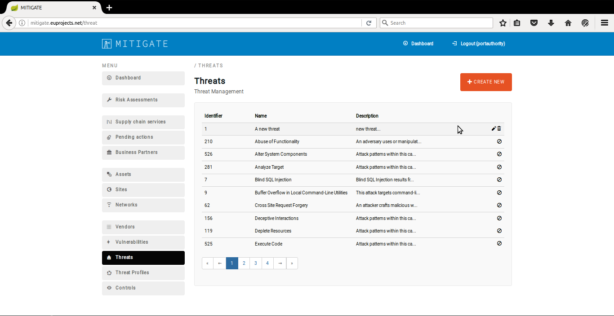
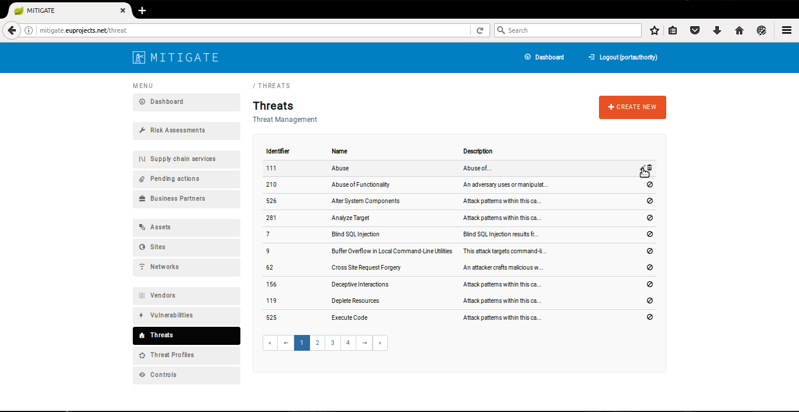
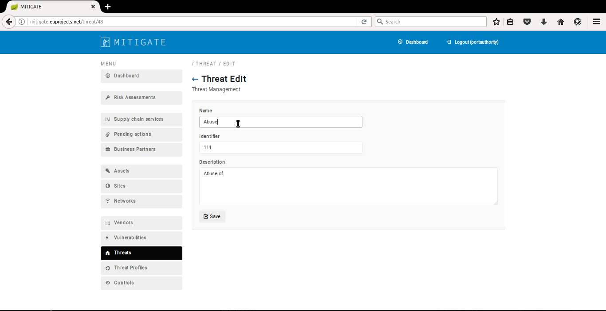
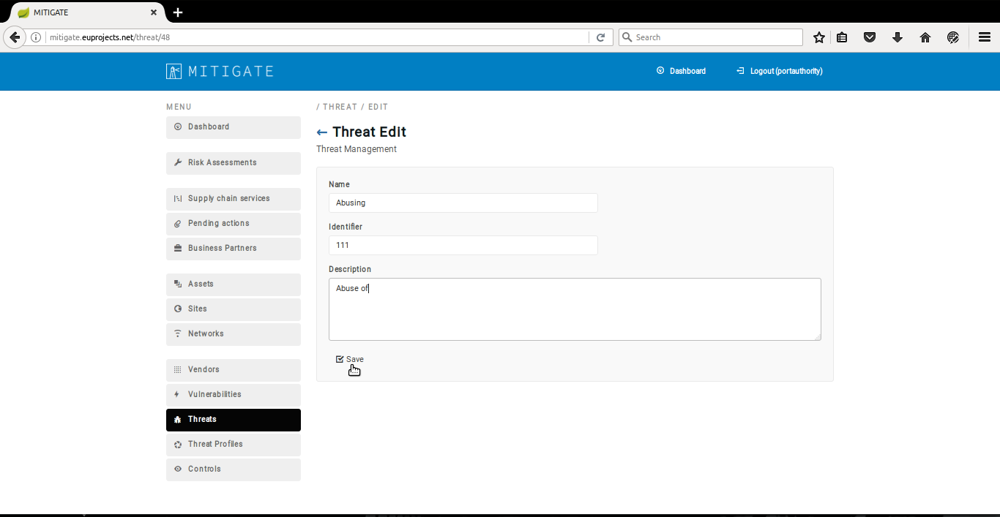
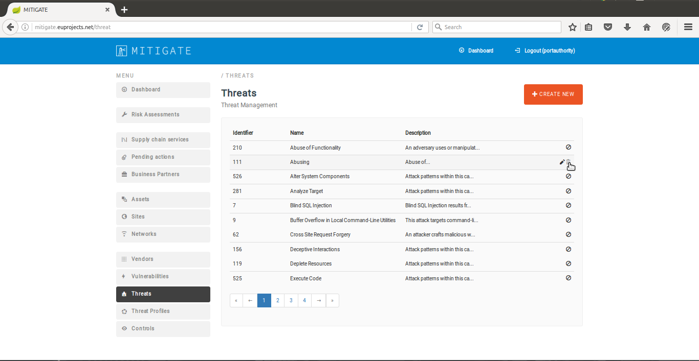

========
Threat Management
========

Declaring a new Threat
--------
- In order to declare a new threat several consecutive steps have to be undertaken .

- Initially the user must login.

.. image:: assets/Log_4.png

- Click on ''Threats'' menu-item.

- Click on "Create New" button.

- Provide threat details such us (Name,Identifier,Description)

- Click on the "Save" button.

- Upon succesful declaration of the new threat the list of declare threats will be update it.

Edit a Threat   
--------
- In order to edit a threat several consecutive steps  have to be undertaken.

- Click on "Threats" menu-item. 

.. image:: assets/edit_threat.png

- Press the "edit" button.

- Apply the requirement changes in "Threat Edit" panel.  

- Click on the "Save" button.

- Upon successful editing of a threat the list of threats will be update it.

.. image:: assets/edit_threat_5.png

Delete a Threat
------------
- In order to delete a threat several consecutive steps have to be undertaken.

- Login to the application

.. image:: assets/Log_4.png

- Click on "Threats" menu-item. 

.. image:: assets/del_threat.png

- Press on "delete" button on the desired threat.

- Upon successful deleting of a threat the list of threats will be update it.

.. image:: assets/del_threat_3.png

    

