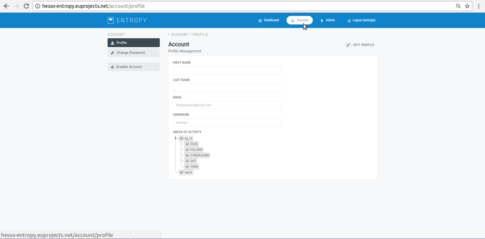
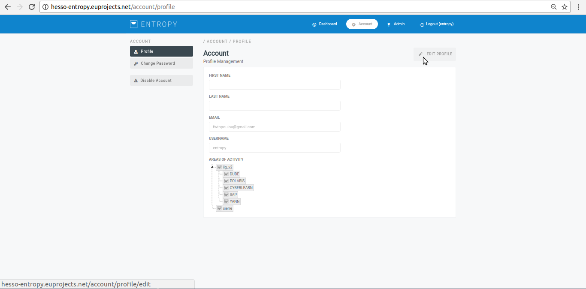
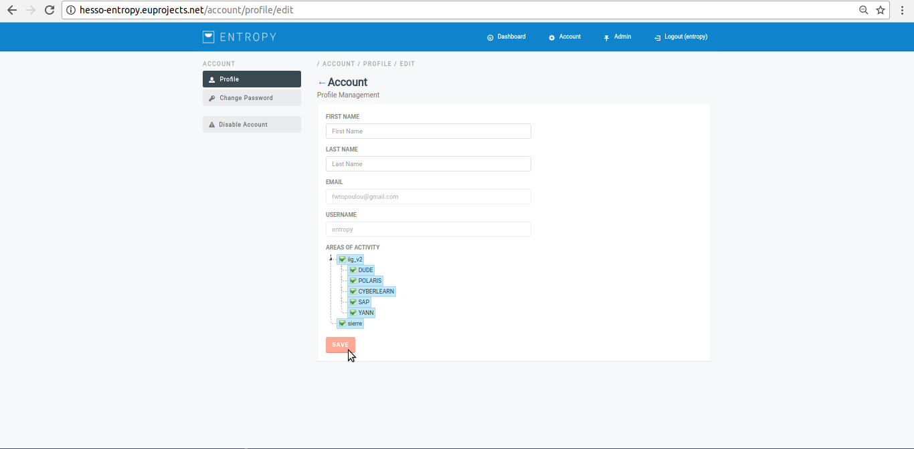
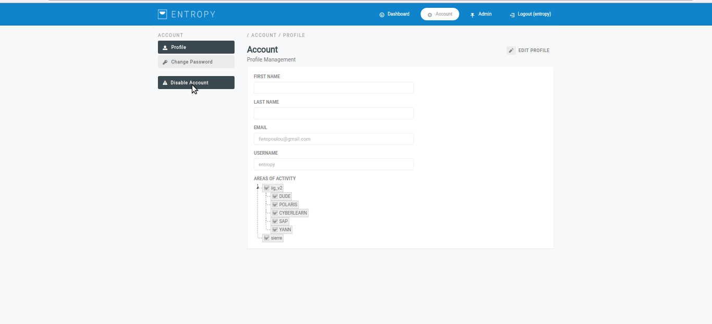

========
Account
========

Edit Profile
--------

- In order to edit an existing profile several consecutive steps have to be undertaken.

- Initially the user must be login.

.. image:: assets/ENTROPY_cmdash.png

- Click on "account" menu-item.

- Click on "edit profile" button.

- Provide profile details and push the "save" button.

- Upon successful update,the overall list of profiles will be update it.

Disable Account
--------

- In order to disable an existing account several consecutive steps have to be undertaken.

- Initially the user must be login.

.. image:: assets/ENTROPY_cmdash.png

- Click on "account" menu-item.

- Press on the “Disable Account” button.

- The desired account has been disabled.
