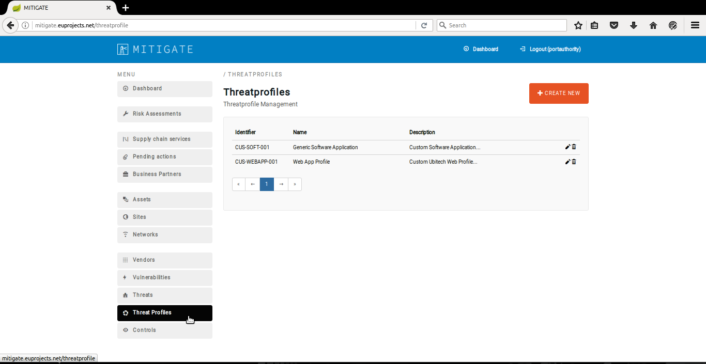
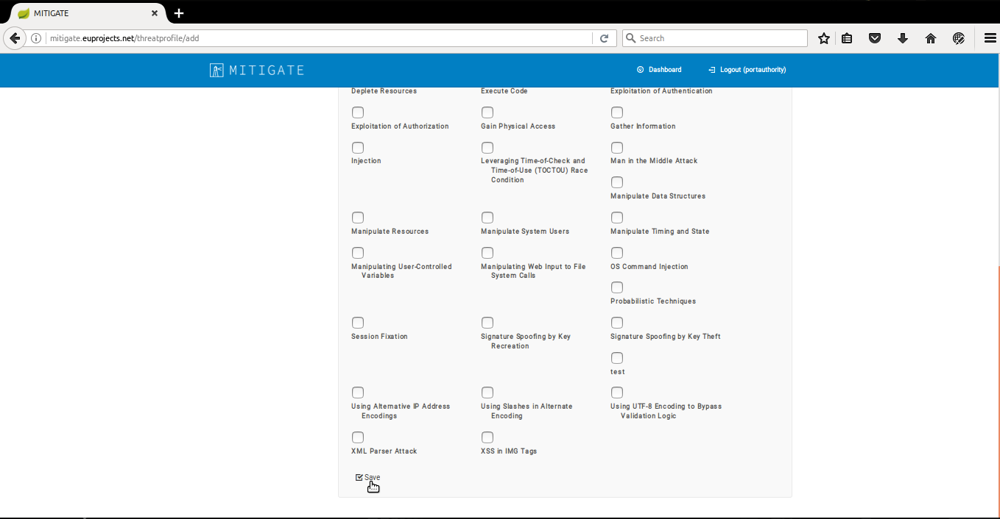
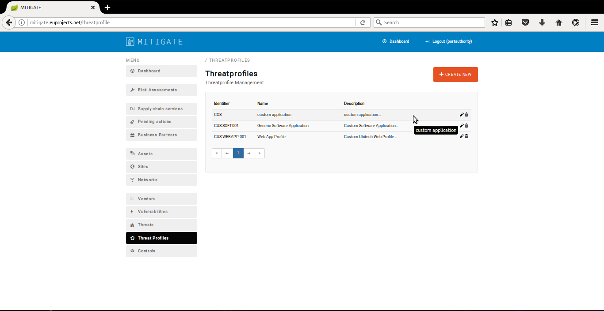
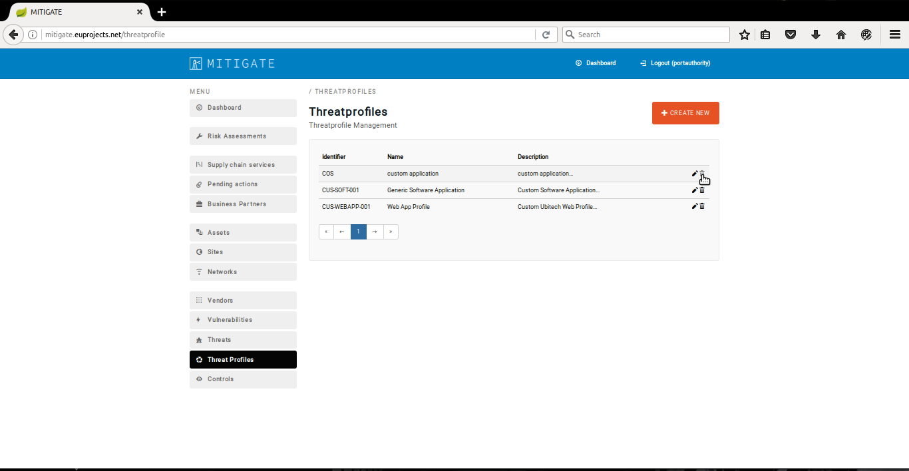
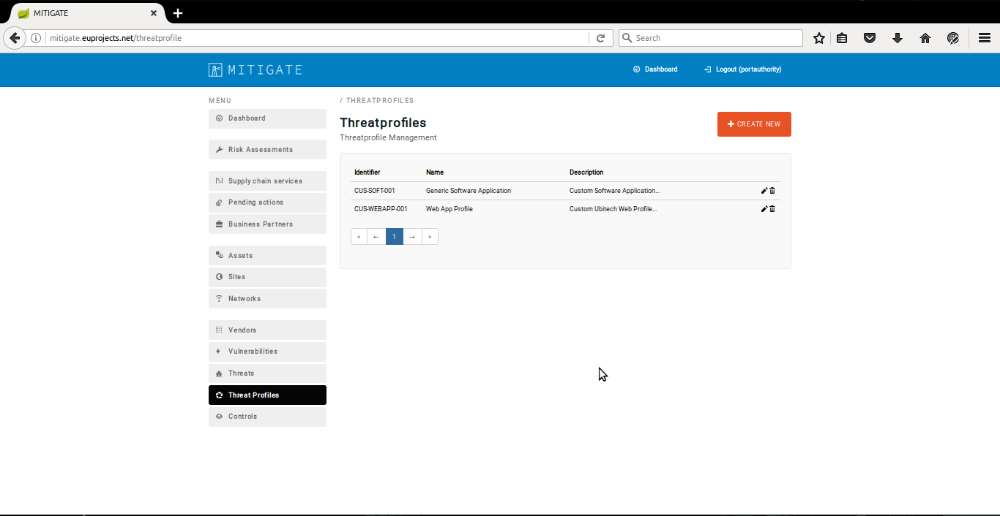
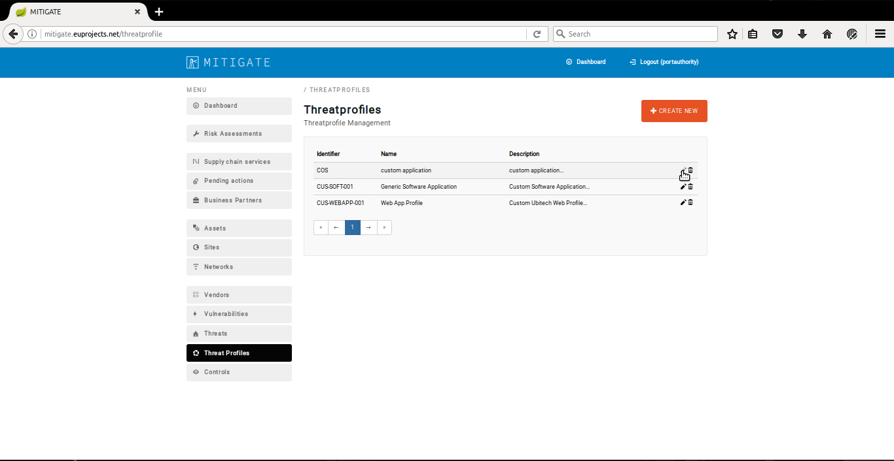
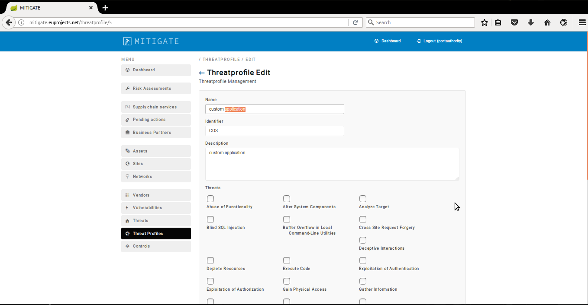
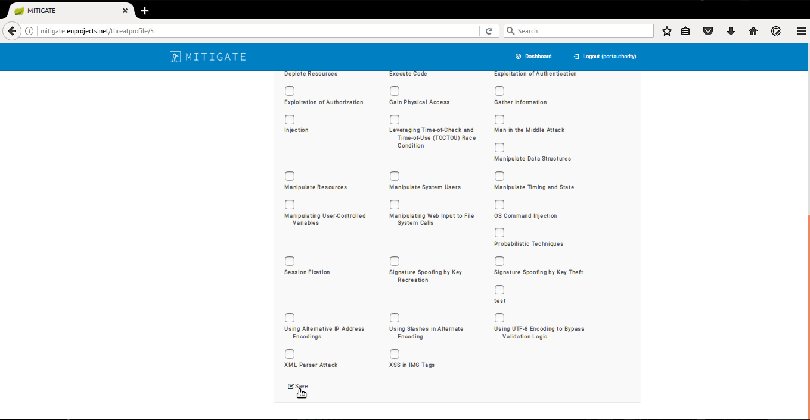

========
Account
========

Update Profile
--------

- In order to declare a new xxxxx profile several consecutive steps have to be undertaken.

- Initially the user must be login.

.. image:: assets/Log_4.png

- Click on "Threat Profile" menu-item.

- Click on create new button.

- Provide threat details and push the "save" button.

- Upon successful creation of new threat profile.The overall list of declare threat profiles will be update it.

Reset password
--------

- In order to delete a threat profile several consecutive steps have to be undertaken.

- Initially the user must be login.

.. image:: assets/Log_4.png

- Click on "Threat Profile" menu-item.

- Press on “delete” button on the desired threat profile.

- Upon successful delete of a threat profile, the overall list of threat profiles will be update it.

Disable Account
--------

- In order to edit a threat profile several consecutive steps have to be undertaken.

- Initially the user must be login.

.. image:: assets/Log_4.png

- Click on "Threat Profile" menu-item.

- Press on the “edit” button.

- Apply the desired changes in “Threat profiles Edit” panel.

- Click on the “Save” button.

- Upon successful editing of a threat profile the list of threat profiles will be update it.

.. image:: assets/ed_tp_5.png
