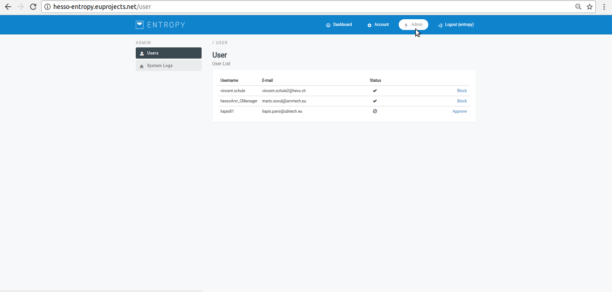
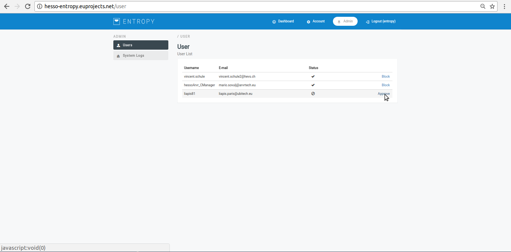
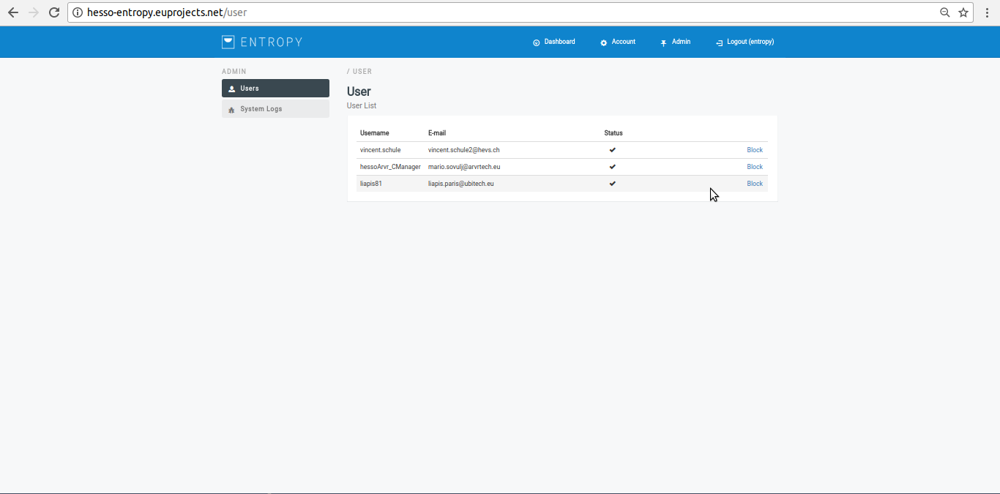
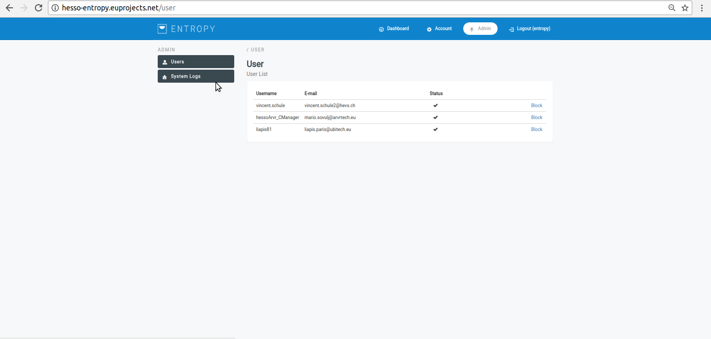
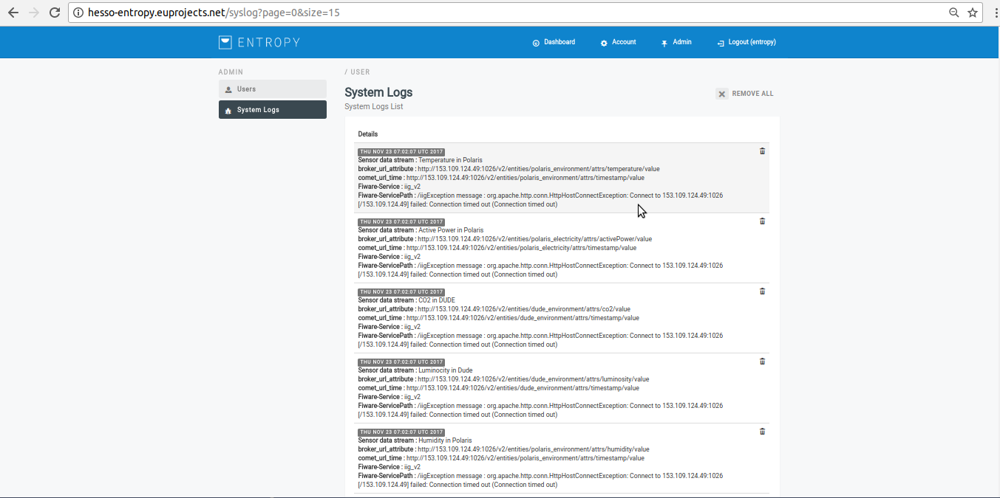

========
Admin
========

Approve Campaign managers
------------
- In order to approve Campaign managers several consecutive steps have to be undertaken.

- Initially the user must be login.

.. image:: assets/ENTROPY_cmdash.png

- Click on "Admin" menu-item.

- Click on "approve" button.

- - Upon successful approve,the overall list of profiles will be update it.

Visualize system Logs
----------

- In order to approve Campaign managers several consecutive steps have to be undertaken.

- Initially the user must be login.

.. image:: assets/ENTROPY_cmdash.png

- Click on "Admin" menu-item.

- Click on "System logs" menu-item.

- The campaign manager can access the apropriate system log.

