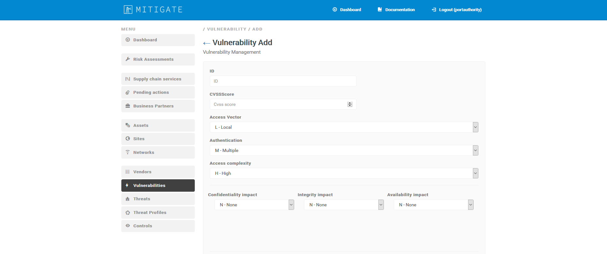

========
Vulnerabilities
========

Edit among publish vulnerabilities
------------
- To edit a vulnerability, select it from the list and click on “Edit” button (pen icon).

.. image:: assets/epv.png
.. image:: assets/epv_2.jpg

- Please notice that all the fields in white can be modified (e.g. ID, CVSS score, access vector, authentication, access complexity, impact). 
Once you have made all changes you deem necessary, click **“Save”**.

Create a zero day vulnerability
----------

- To add a new vulnerability, click **“Vulnerabilies”** on the menu (left-hand side) and press **“Create new”** button. 

- Fill in the information required and then click **“Save”**.

