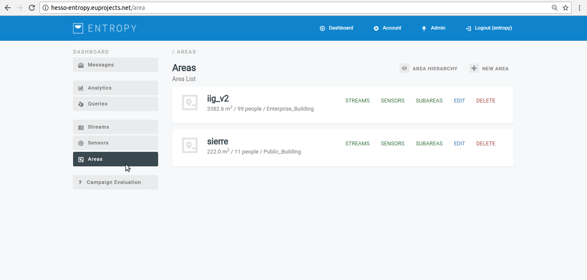
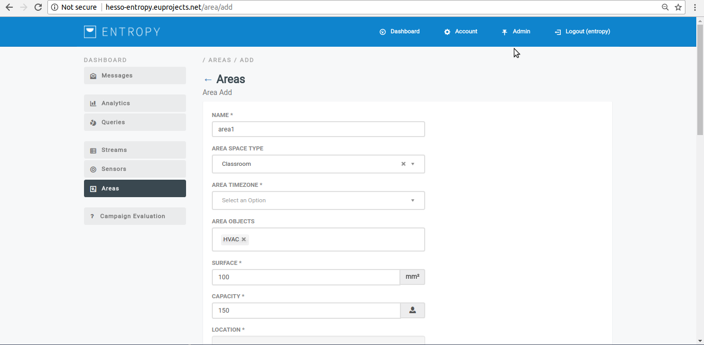
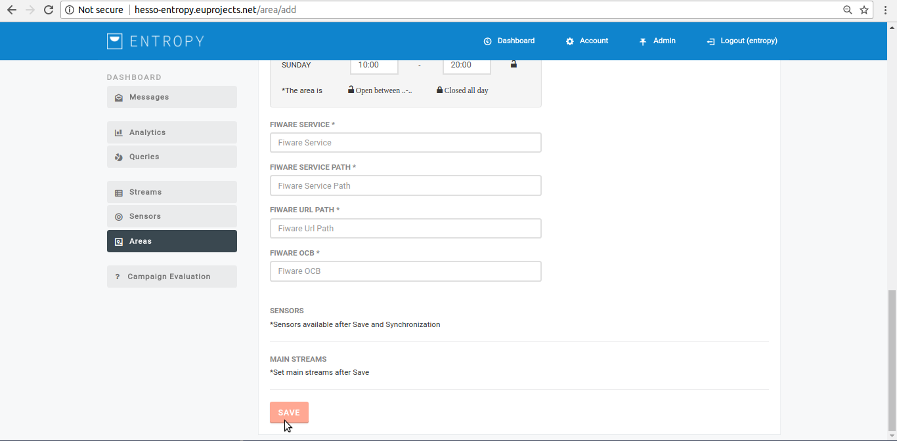
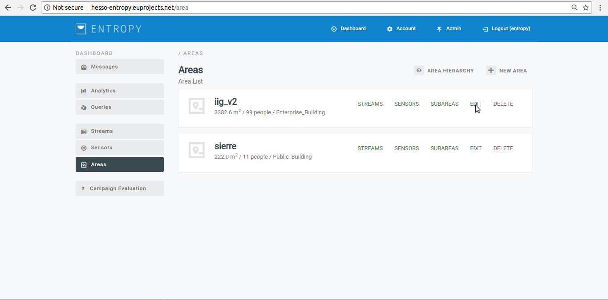
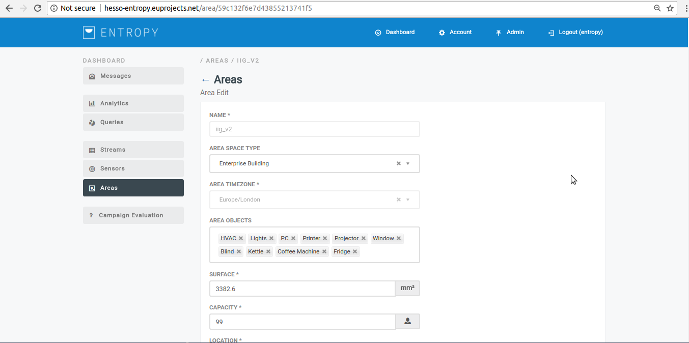
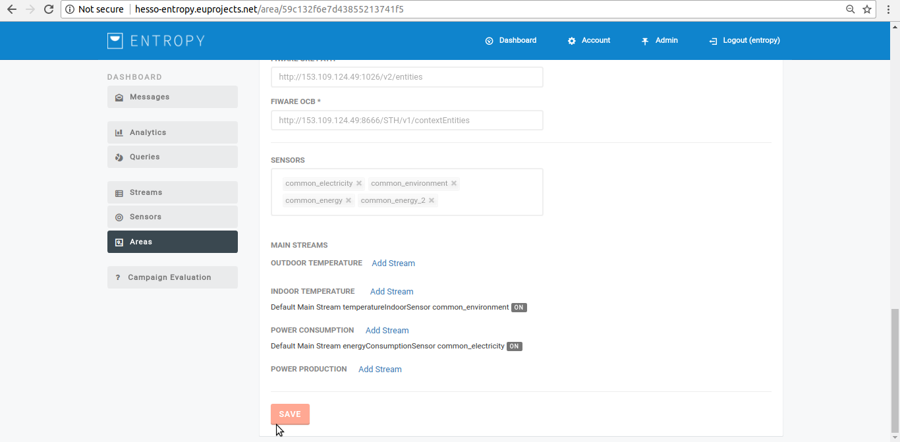
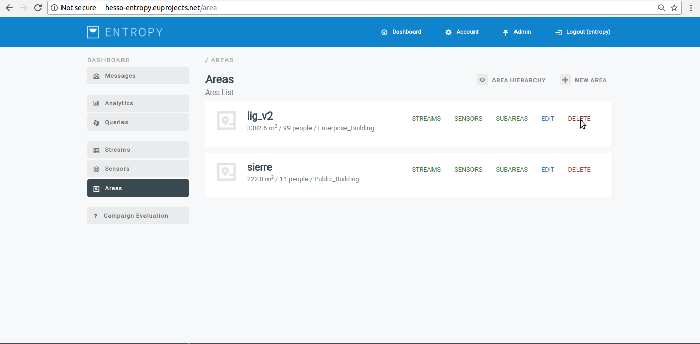

========
Register a new Building area
========

Register a new Building Area
------------------------

- In order register a new building area several consecutive steps have to be undertaken .
- Initially the user must login.

.. image:: assets/ENTROPY_cmdash.png

- Click on "Areas" Menu-item.

- Click on "New Area" button.

.. image:: assets/ENTROPY_newera_2.png

- Provide the new area details and click on "Save" button.

- Upon successful addition, the new area  appears in area list.

Edit a Building Area
------------
- In order to edit an existing building area consecutive steps have to be undertaken .
- Initially the user must login.

.. image:: assets/ENTROPY_cmdash.png

- Click on "Areas" Menu-item.

- Click on "EDIT" button.

- Provide the edit area details and click on "Save" button.

- During editing the admin can move sensors from main areas to sub areas.

- It is also possible to define some main steams per area. Main streams have a default frequency of one hour and refer to indoor/outdoor temperature and consumption and production power. it is necessary to define this because serveral analytic packages make use of them so as to calculate the energy saving and waste compared with the calculated consumption baseline.

- Default main stream are declared by clicking on "Add stream" option as seen followingly:

.. image:: assets/defineMainStream.png

- Upon successful editing, the modified area appears in the list.

Delete Building Area
------------

- In order to delete a building area several consecutive steps have to be undertaken .
- Initially the user must login.

.. image:: assets/ENTROPY_cmdash.png

- Click on "Areas" Menu-item.

- Click on "DELETE" button.

- Upon successful delete of the selected area,the area list will be modified.
