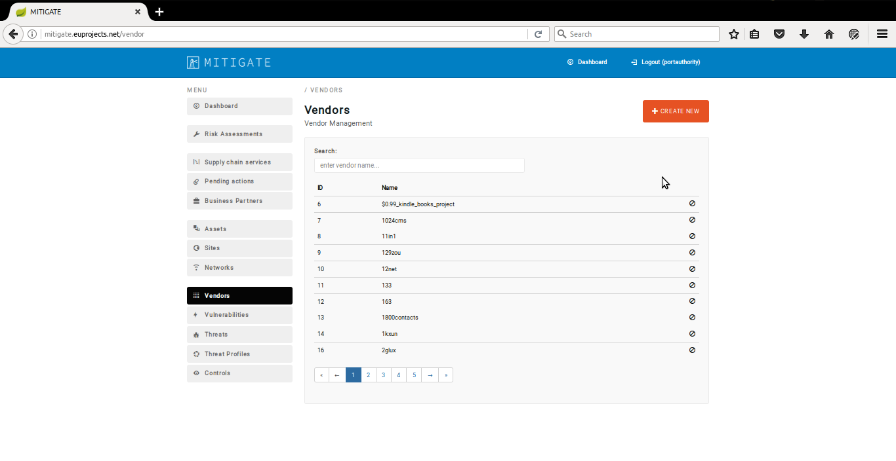
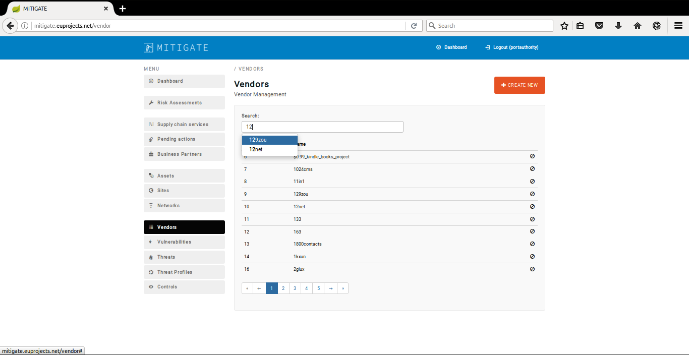
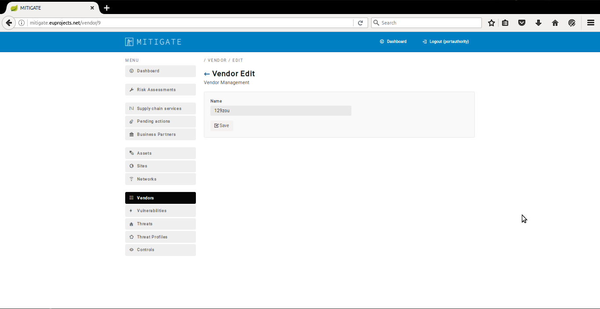
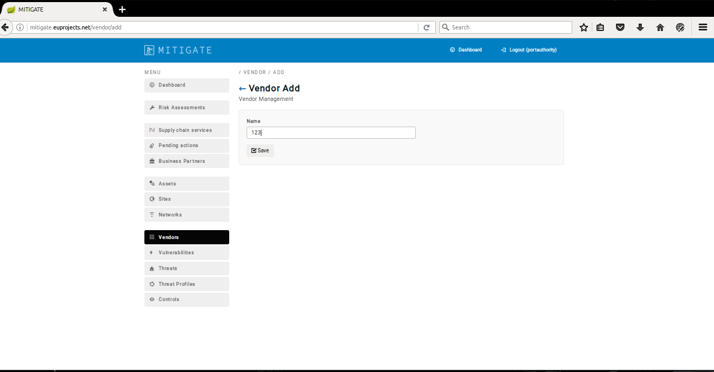

========
Register a new Building area
========

Register a new Building Area
------------------------

- In order to search the vendor list several consecutive steps have to be undertaken .
- Initially the user must login.

.. image:: assets/Log_4.png

- Click on "Vendors" Menu-item.

- Provide vendor details in the prompted text box and click on preferred vendor from prompted dropdown list.

- Upon succesful search, the preferred vendor appears in vendor management list.

Edit a Building Area
------------
- In add a vendor several consecutive steps have to be undertaken .
- Initially the user must login.

.. image:: assets/Log_4.png

- Click on "Vendors" Menu-item.

- Click on “Create New” button.

.. image:: assets/ed_v.png

- Provide vendor details in textbox area.

- Click on the “Save” button.

.. image:: assets/ed_v_2.png

- Upon successful addition of a vendor, the list of vendors will be update it.

.. image:: assets/ed_v_2.png

Delete Building Area
------------

- In order to edit a vendor several consecutive steps have to be undertaken .
- Initially the user must login.

.. image:: assets/Log_4.png

- Click on "Vendors" Menu-item.

- Press the “edit” button.

.. image:: assets/ev_1.png
