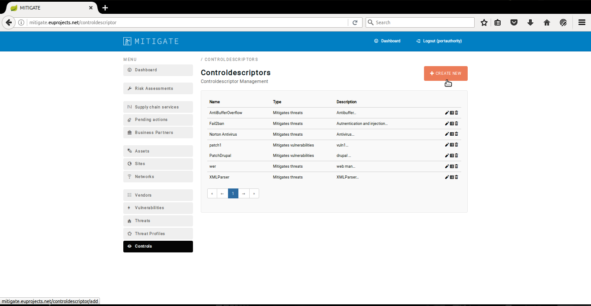
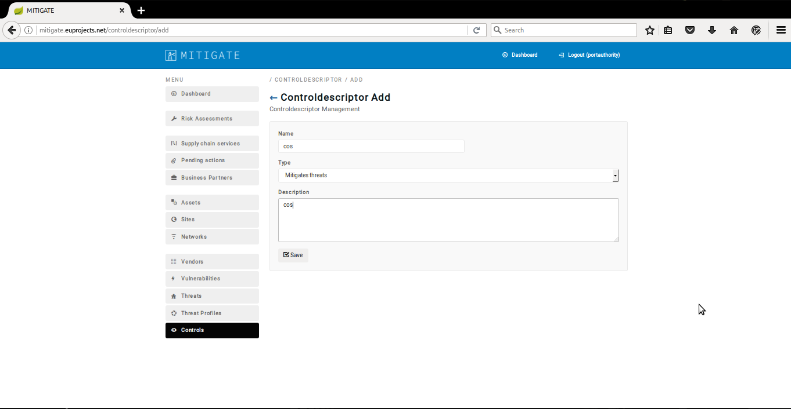
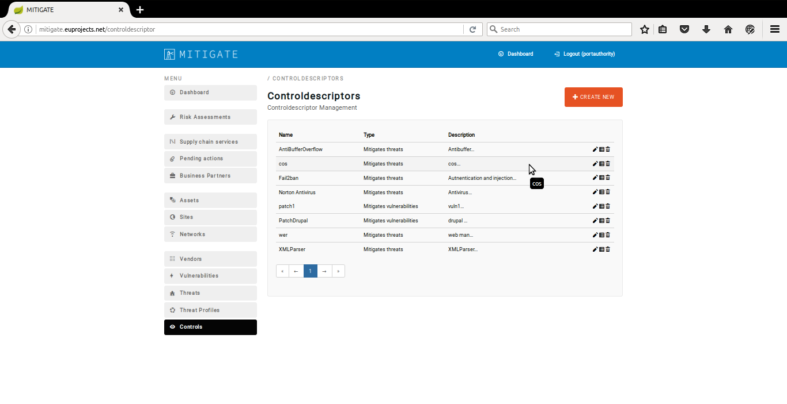
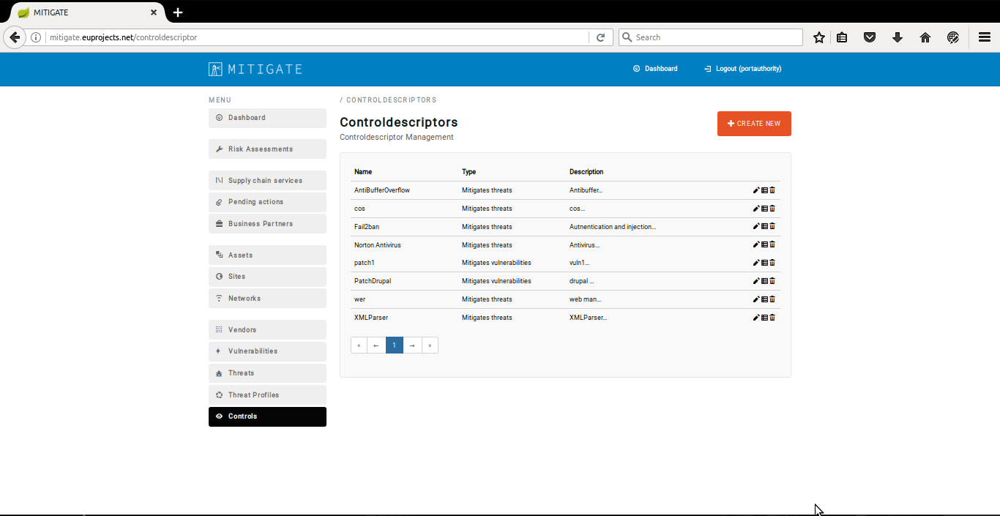
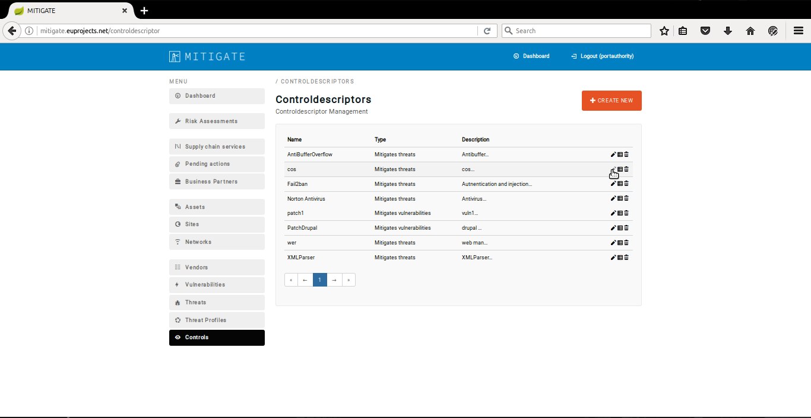
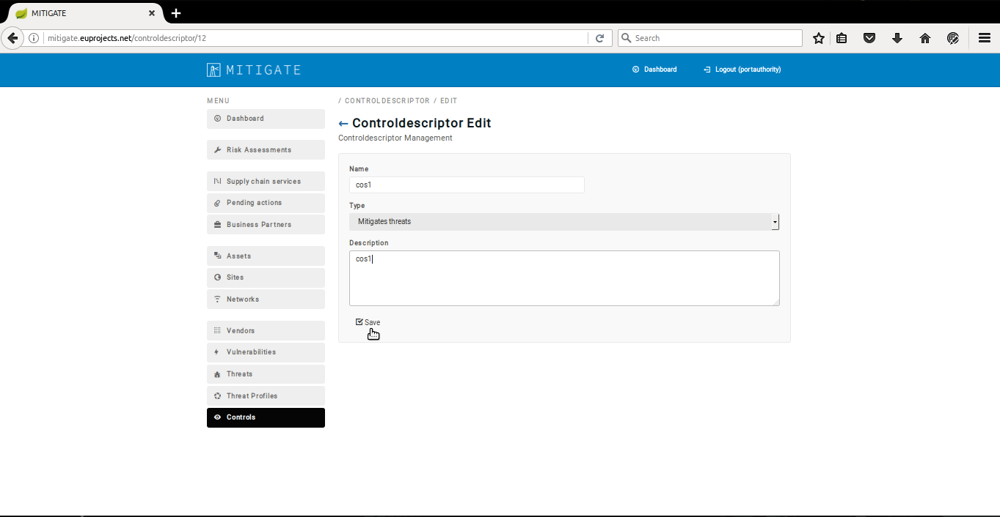

============
Control Management
============

Declaring a new control
-----------------------

- In order to declare a new control  several consecutive steps have to be undertaken .
- Initially the user must login.

.. image:: assets/Log_4.png

- Click on “Controls” Menu-item.

- Click on “Create New” button.

- Provide control details such us (Name,Type,Description)

- Upon successful declaration, the new control appears in control management list.

Managing a new control
----------------------
- In order to managung  a new control  several consecutive steps have to be undertaken .
- Initially the user must login.

.. image:: assets/Log_4.png

- Click on “Control” menu-item.

- Press the “edit” button.

- Apply the requirement changes in “Control Descriptor Edit” panel. 

- Upon successful editing of a control the list of controls will be update it.

Delete a Control
----------------

- In order to delete a control several consecutive steps have to be undertaken .

- Initially the user must login.

.. image:: assets/Log_4.png

- Click on “Control” menu-item.

- Press on “delete” button on the desired control.

.. image:: assets/dc.png

- Upon successful deletion of a control, the overall list of controls will be update it.

.. image:: assets/dc_2.png

