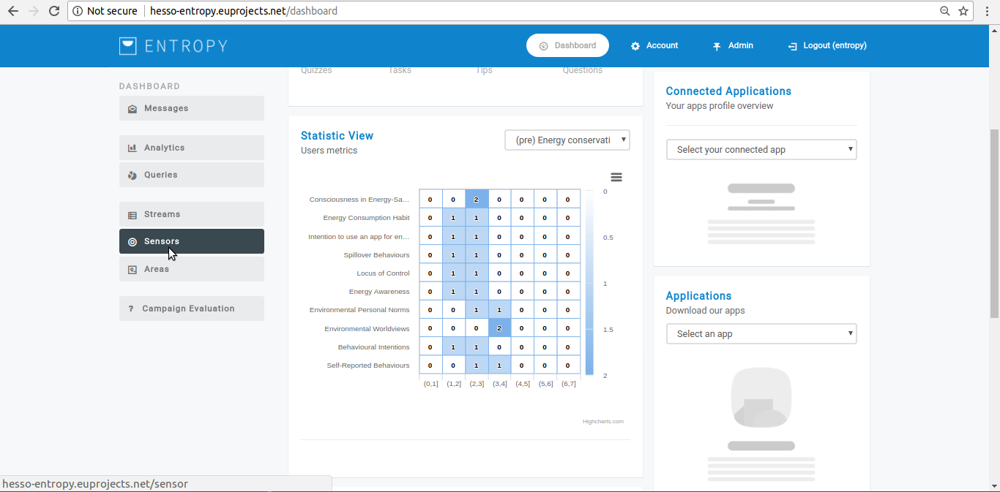
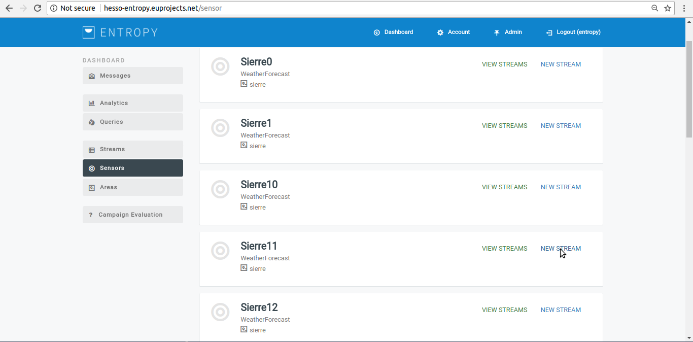
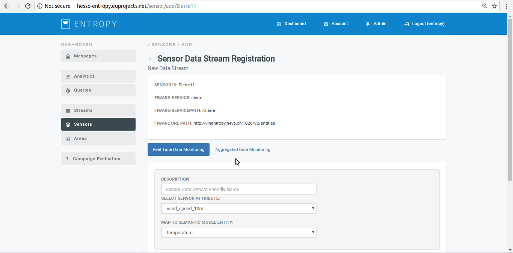
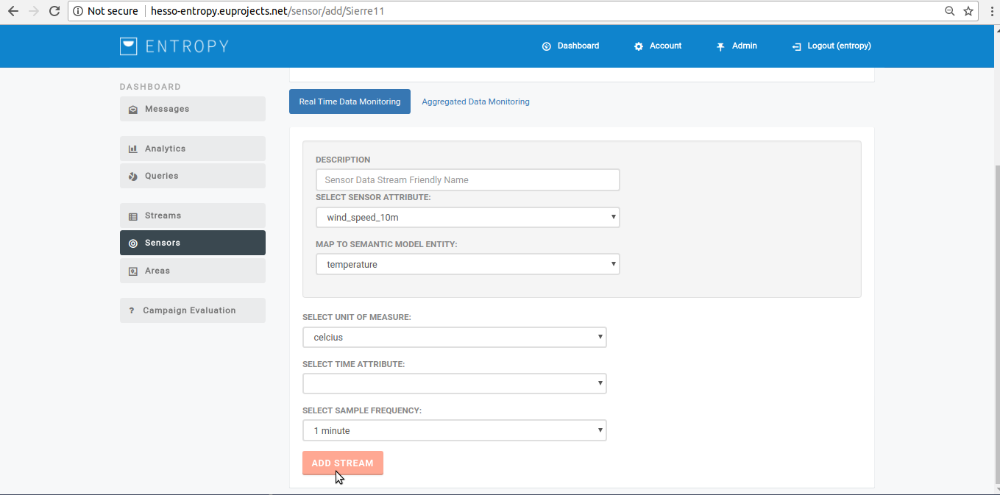
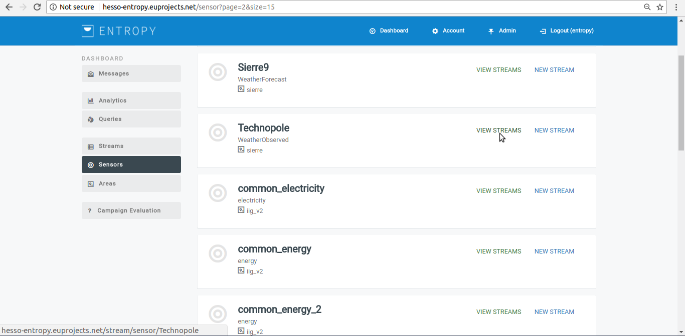
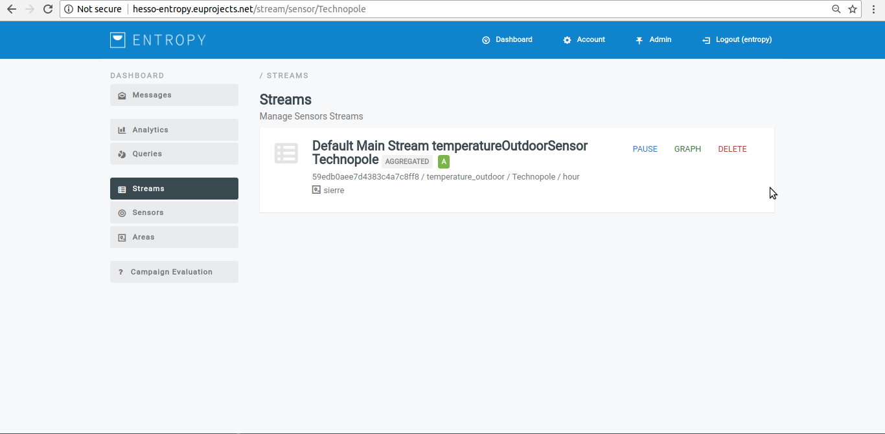

============
Synchronize sensors
============

Create a new stream from a specific sensor
-----------------------

- In order to create a new stream from a specific sensor  several consecutive steps have to be undertaken .
- Initially the user must login.

.. image:: assets/ENTROPY_cmdash.png

- Click on “Sensors” Menu-item.

- Click on “New Stream” button.

- Provide new data streams details such us (Real Time or Aggregated data monitoring, sensor attribute, Description etc).

- Click on "Add Stream" button.

- Upon successful declaration, the new stream appears in sensor management list.

View streams generated by a sensor
----------------------
- In order to view streams that generated by sensor several consecutive steps have to be undertaken .
- Initially the user must login.

.. image:: assets/ENTROPY_cmdash.png

- Click on “Sensor” menu-item.

- Press the “view streams” button.

- The campaign manager can access the appropriate stream.

