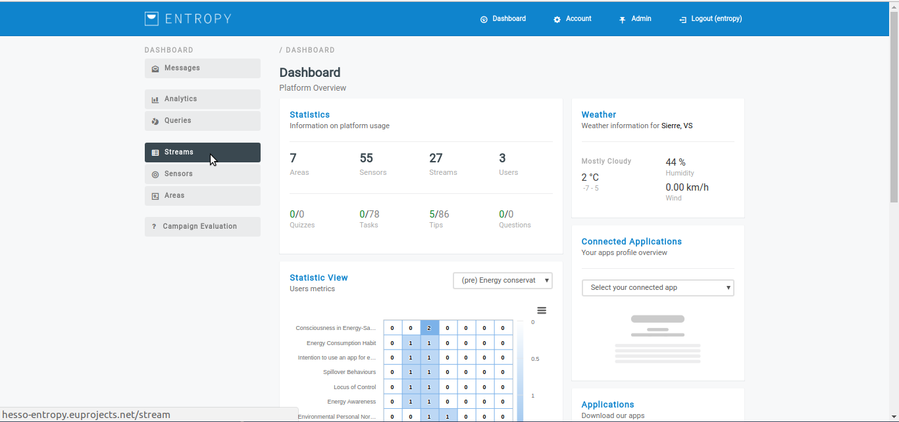
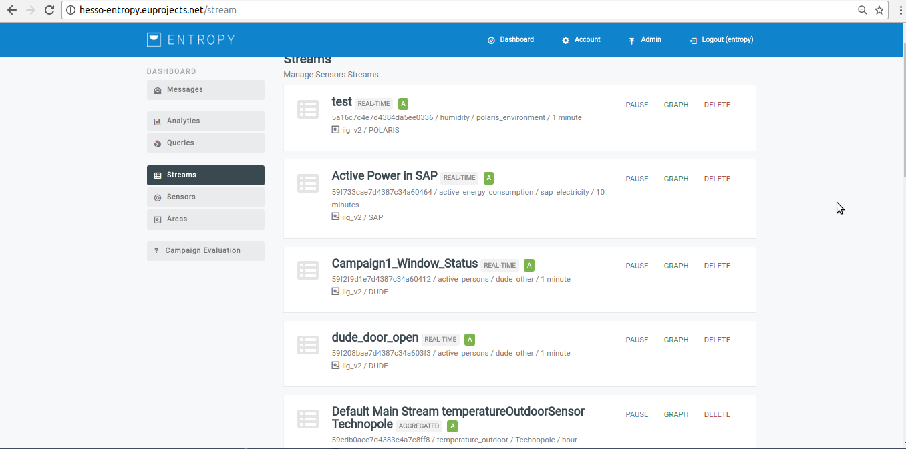
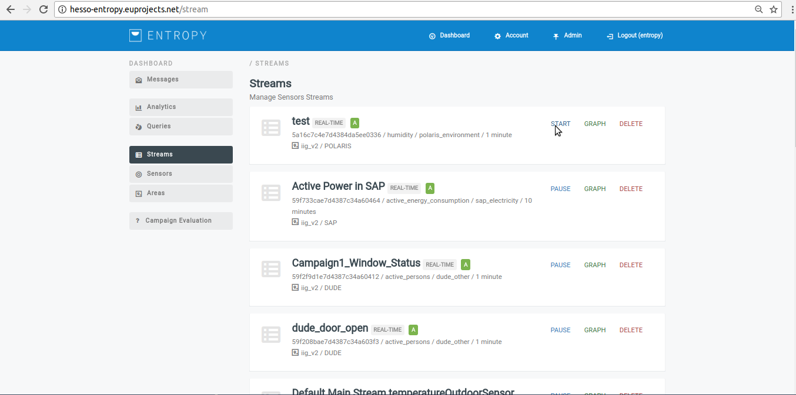
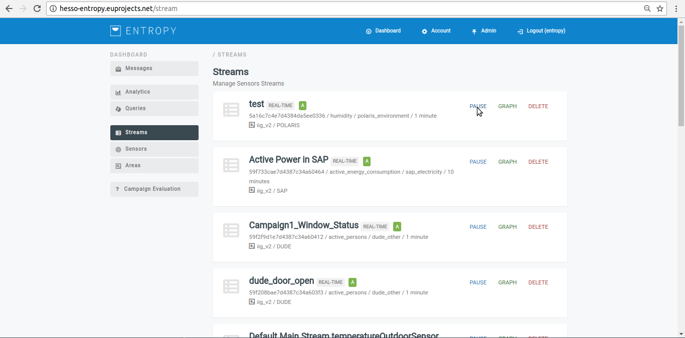
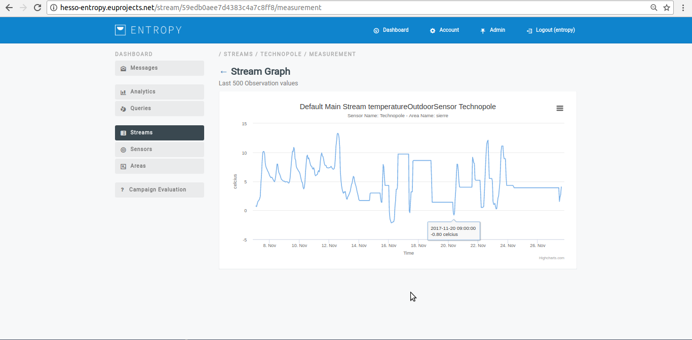

============
Streams
============

Visualize streams
-----------------------
- In order to visualize a new stream several consecutive steps have to be undertaken .
- Initially the user must login.

.. image:: assets/ENTROPY_cmdash.png

- Click on “Streams” menu-item.

- step 2.

Start/stop stream
----------------------

- In order to Start/stop a stream several consecutive steps have to be undertaken .

- Initially the user must login.

.. image:: assets/ENTROPY_cmdash.png

- Click on “Streams” menu-item.

- Click on “start” button.

- Press the “pause” button.

Visualize stream graph
----------------

- In order to Visualize stream graph several consecutive steps have to be undertaken .

- Initially the user must login.

.. image:: assets/ENTROPY_cmdash.png

- Click on “Streams” menu-item.

- Press on “graph” button on the desired stream.

.. image:: assets/ENTROPY_stream_7.png

- Upon successful selection,the desired stream graph can be viewed.

