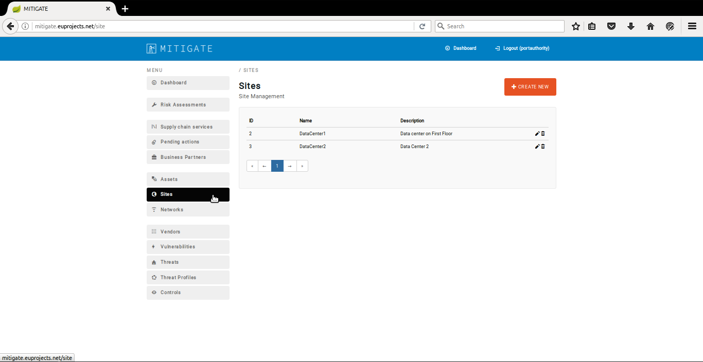
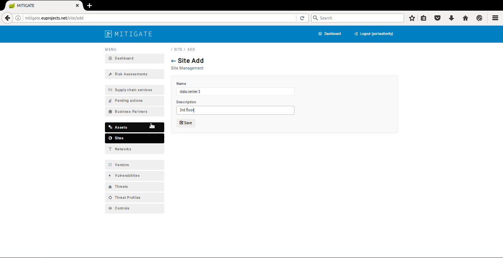
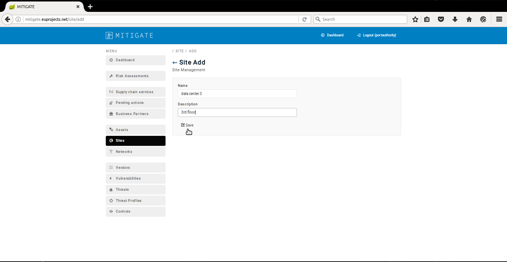
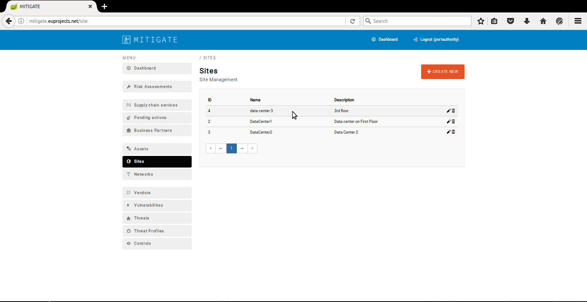
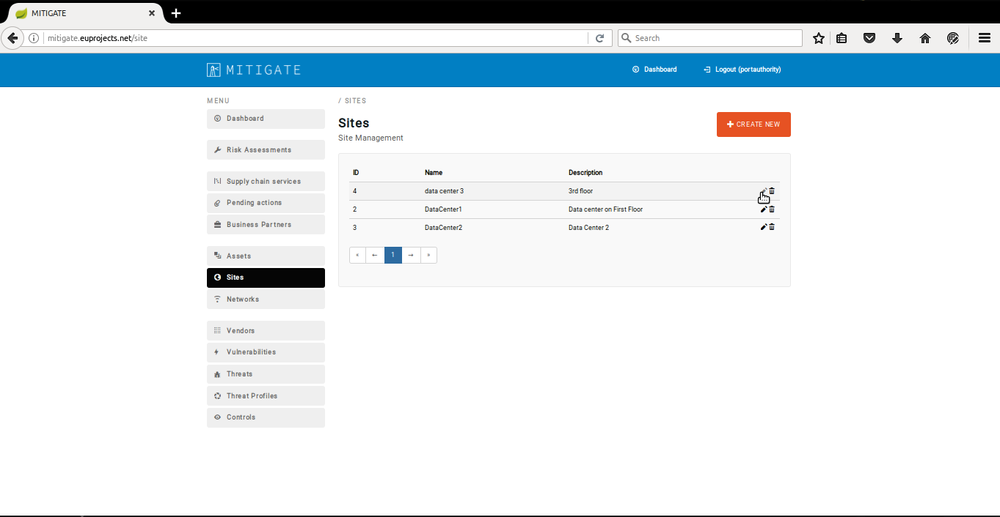
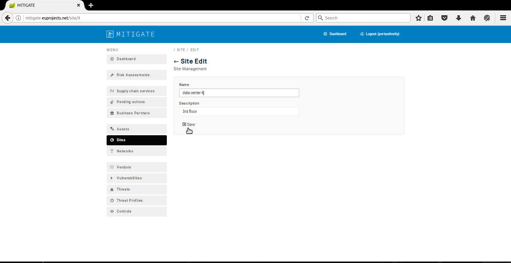

============
Streams
============

Visualize streams
-----------------------
- In order to declare a new site several consecutive steps have to be undertaken .
- Initially the user must login.

.. image:: assets/Log_4.png

- Click on “Sites” menu-item.

- Click on "create new" button.

- Provide site details and push the “save” button.

- Push the “save” button.

- Upon successful creation of new site, the overall list of declare sites will be update it.

Start/stop stream
----------------------

- In order to edit a site several consecutive steps have to be undertaken .

- Initially the user must login.

.. image:: assets/Log_4.png

- Click on “Sites” menu-item.

- Press the “edit” button.

- Apply the requirement changes in “Site Edit” panel, and click on the “Save” button.

- Upon successful editing of a site the list of sites will be update it.

Visualize stream graph
----------------

- In order to delete a site several consecutive steps have to be undertaken .

- Initially the user must login.

.. image:: assets/Log_4.png

- Click on “Sites” menu-item.

- Press on “delete” button on the desired site.

.. image:: assets/ds.png

- Upon successful delete of a site, the list of sites will be update it.

.. image:: assets/ds_2.png
