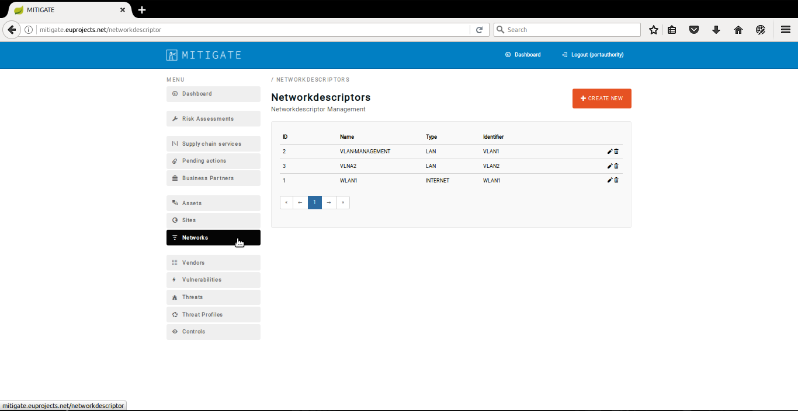
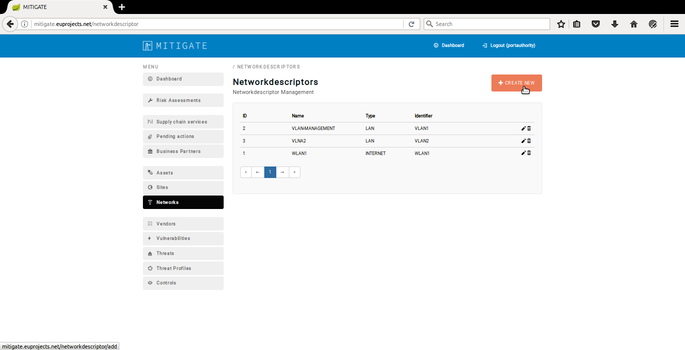
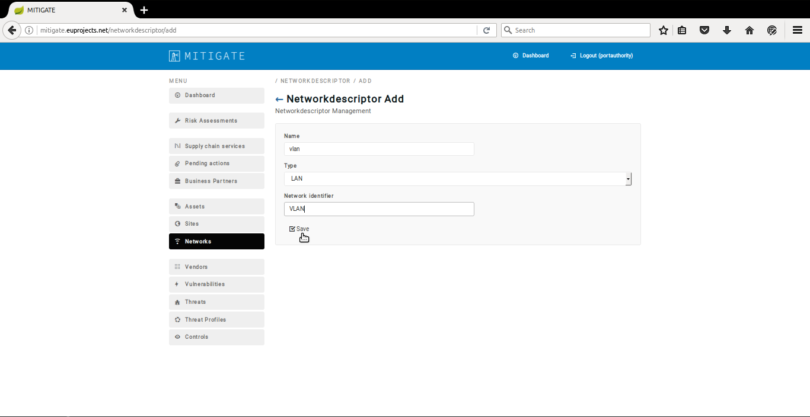
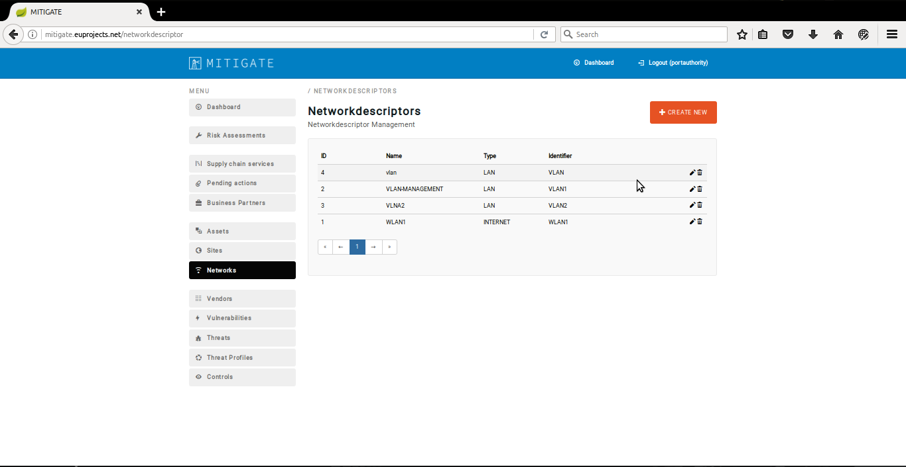
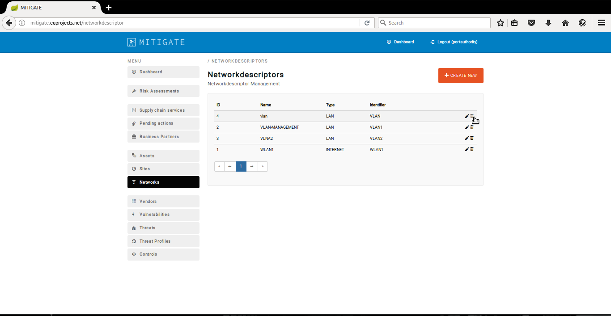
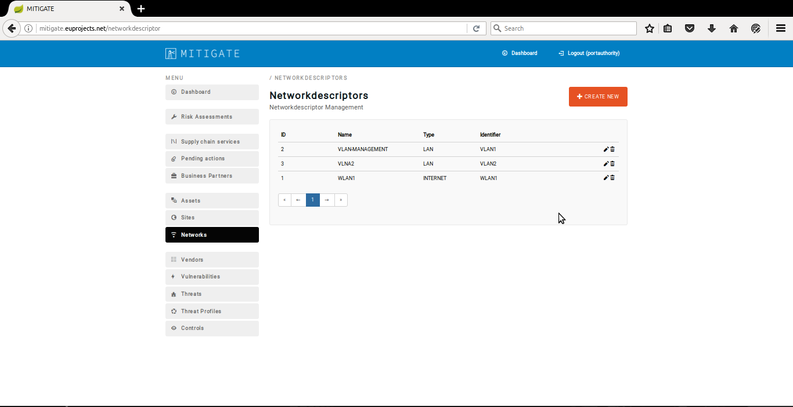

============
Network Management
============

Declaring a new network
-----------------------

- In order to declare a new network several consecutive steps have to be undertaken .

- Initially the user must login.

.. image:: assets/Log_4.png

- Click on ‘’Networks’’ menu-item.

- Click on “Create New” button.

- Provide network details such us (Name,type,Network Identifier) and click on the “Save” button.

- Upon succesful declaration of the new network the list of declare networks will be update it.

Edit a network
----------------------

- In order to edit a network several consecutive steps have to be undertaken .

- Initially the user must login.

.. image:: assets/Log_4.png

- Click on ‘’Networks’’ menu-item.

- Press the “edit” button.

.. image:: assets/en_2.png

- Apply the requirement changes in “Network descriptor Edit” panel.

.. image:: assets/en_3.png

- Click on the “Save” button.

.. image:: assets/en_4.png

- Upon successful editing of a network the list of networks will be update it.

Delete an existing network
----------------

- In order to delete a network several consecutive steps have to be undertaken .

- Initially the user must login.

.. image:: assets/Log_4.png

- Click on ‘’Networks’’ menu-item.

- Press on “delete” button on the desired network.

- Upon successful deleting of a network the list of networks will be update it. 

