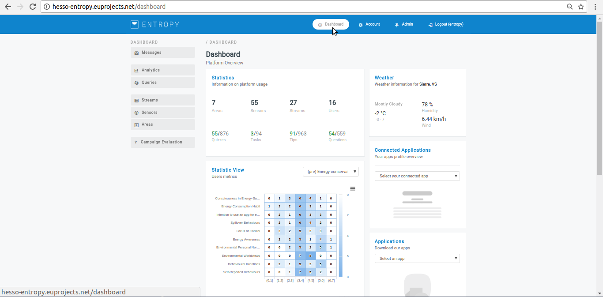
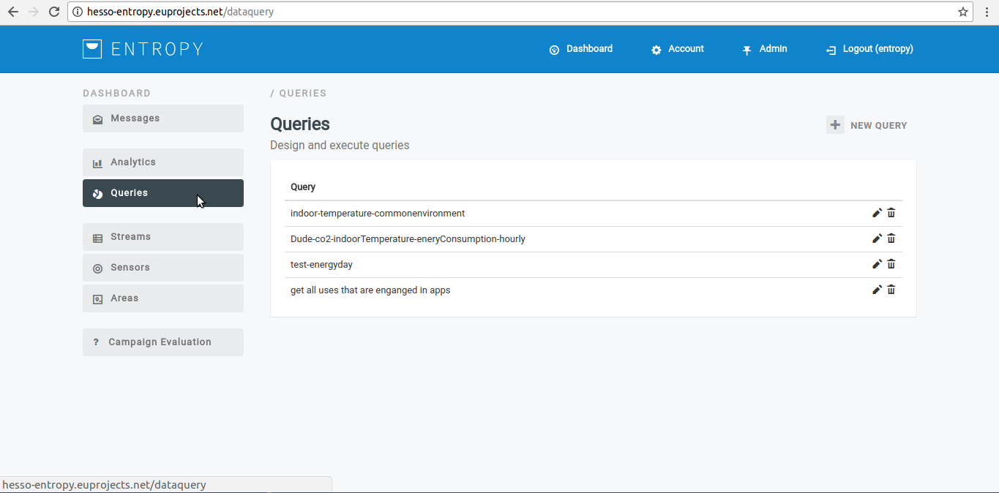
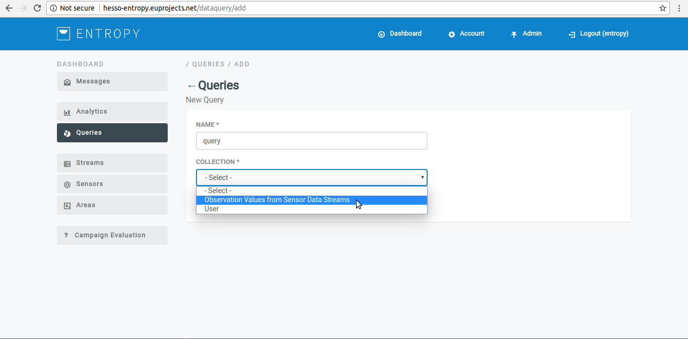
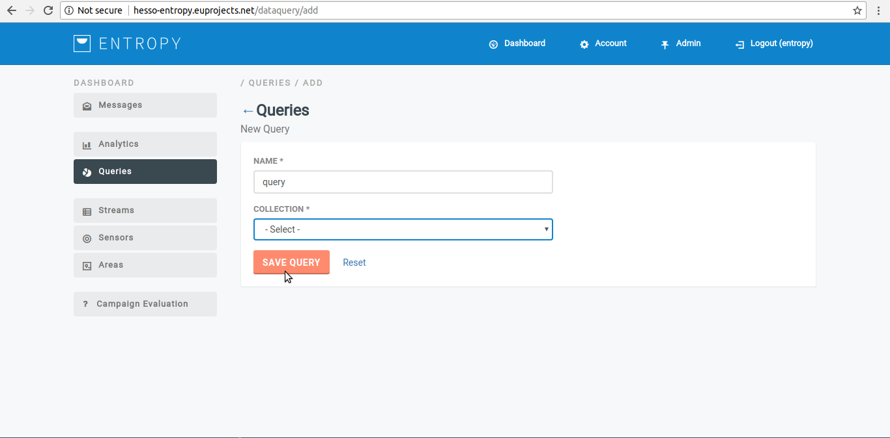
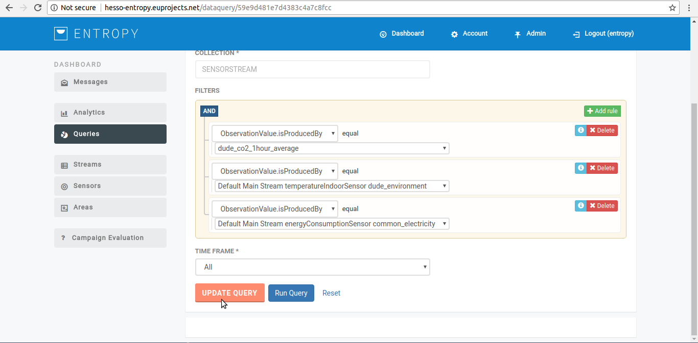

============
Queries
============

Create a new query
-----------------------
- In order to create a new query several consecutive steps have to be undertaken.

- Initially the user must be login.

- Click on "Queries" menu-item.

- Click on "New Query" button.

- Provide now query details such us (Observation Values from data sensor streams, User, Etc)

- Click on "Save Query" button.

- Upon successful addition, the new query  appears in list.

Edit a query
-----------------------
- In order to edit a query, several consecutive steps have to be undertaken.

- Initially the user must be login.

- Click on "Queries" menu-item.

- Click on edit button(pencil item).

- Click on "Update Query" button.

- The selected query has been updated.

Execute a query
-----------------------
- In order to execute a query, several consecutive steps have to be undertaken.

- Initially the user must be login.

- Click on "Queries" menu-item.

- Click on "Run Query" button.

.. image:: assets/ENTROPY_query_7.png

- The selected query has been executed.

Delete a query
-----------------------
- In order to delete a query, several consecutive steps have to be undertaken.

- Initially the user must be login.

- Click on "Queries" menu-item.

- Click on delete Query button.

- The selected query has been deleted.
