============
 Analytics
============
 
Algorithm
------------
 
**Register a new algorithm**
 
- In order to register a new algorithm several consecutive steps have to be undertaken .
- Initially the user must login.

.. image:: assets/ENTROPY_cmdash.png

- Click on "Analytics" menu-item.

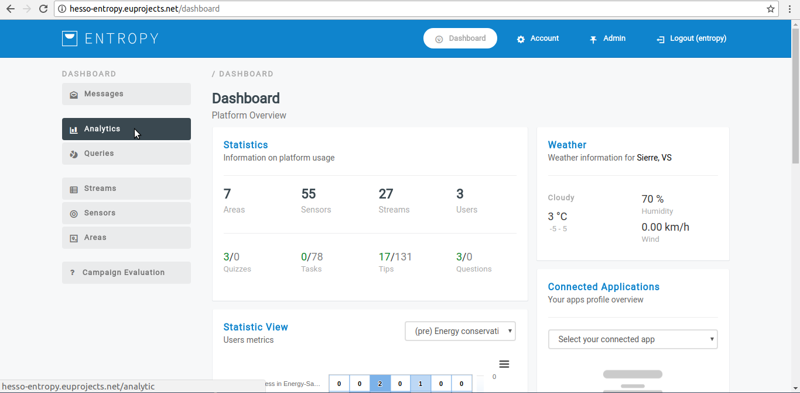

- Click on "Algorithms" button.

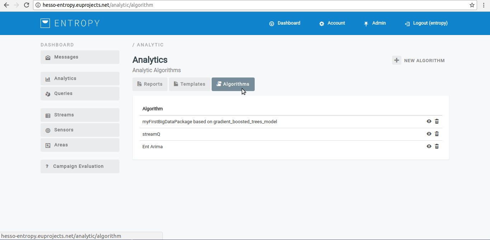

- Click on "New Algorithm" button.

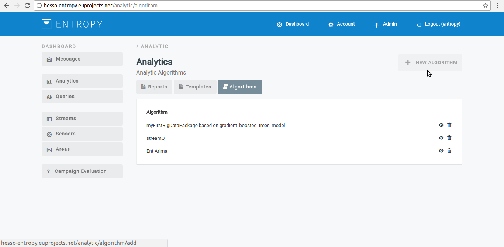

- Provide new algorithm details.

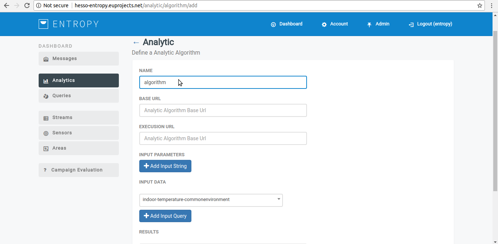

- Click on "Save" button.

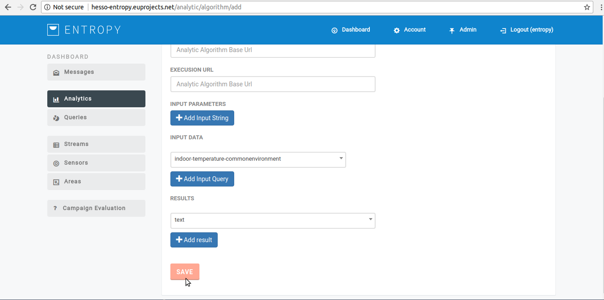

- You have successfully create new algorithm. View a registered algorithm

**View a registered algorithm**

- In order to view a registered algorithm several consecutive steps have to be undertaken .
- Initially the user must login.

.. image:: assets/ENTROPY_cmdash.png

- Click on "Analytics" menu-item.

- Click on "Algorithms" button.

- Click on View button(eye object).

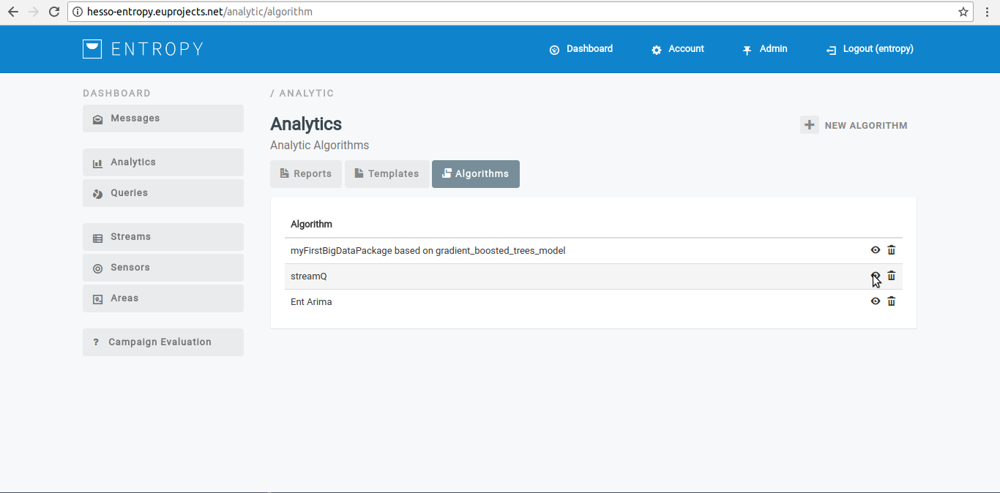

- The registered algorithm appears in the platform.

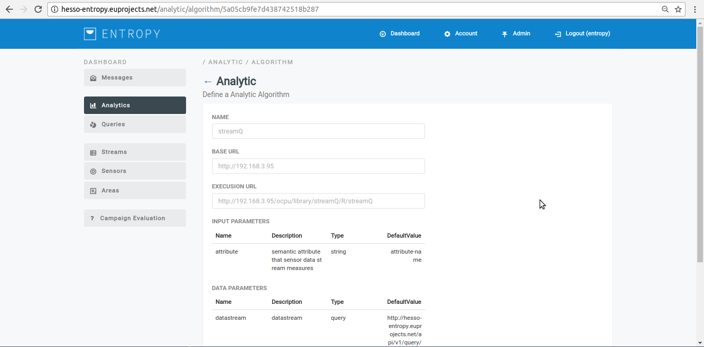

**Delete an algorithm**
 
- In order to delete a registered algorithm several consecutive steps have to be undertaken .
- Initially the user must login.

.. image:: assets/ENTROPY_cmdash.png

- Click on "Analytics" menu-item.

- Click on "Algorithms" button.

- Click on delete button (bin object).

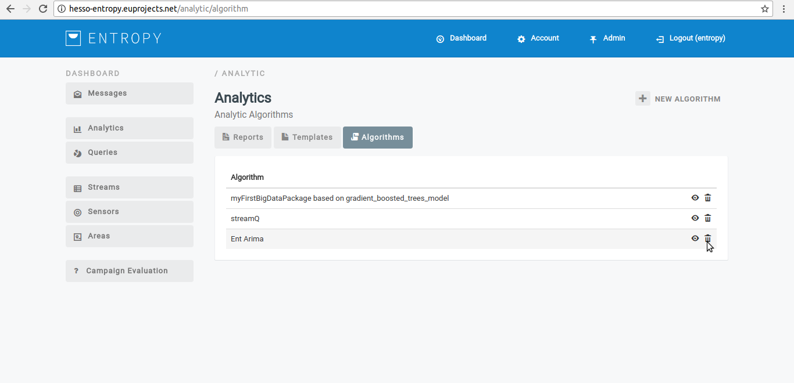

- You have successfully delete the selected algorithm.

Algorithm Template
 ----------------------

 **Create a new algorithm template**
 
- In order to create a new algorithm template consecutive steps have to be undertaken .
- Initially the user must login.

.. image:: assets/ENTROPY_cmdash.png

- Click on "Analytics" menu-item.

- Click on "Templates" button.

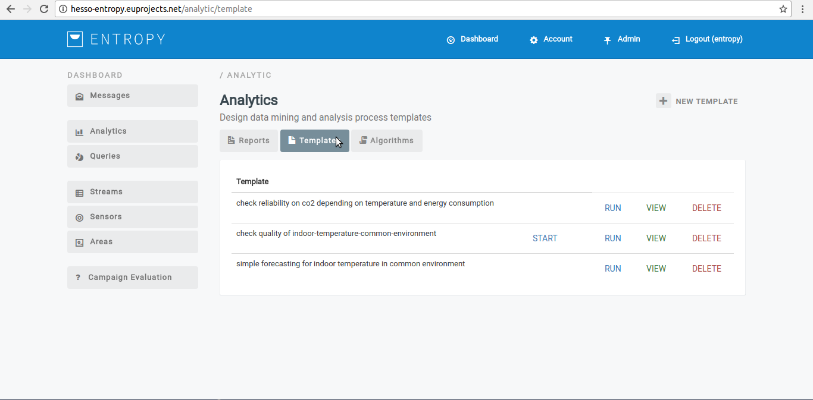

- Click on "New Template" button.

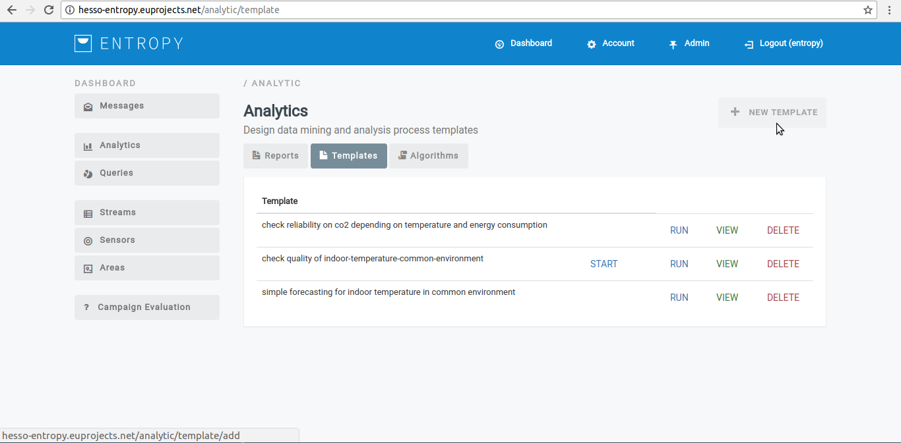

- Provide custom analytic process template details.

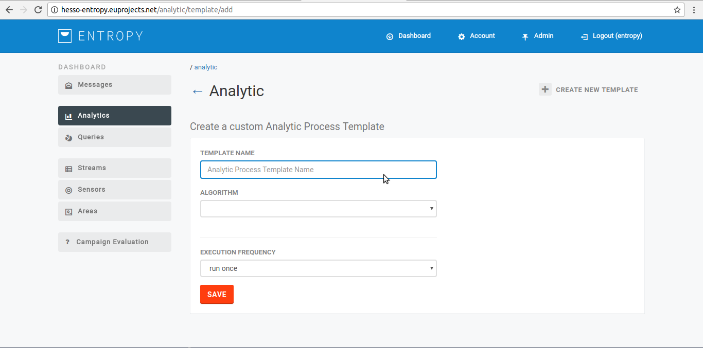

- Click on "Save" button.

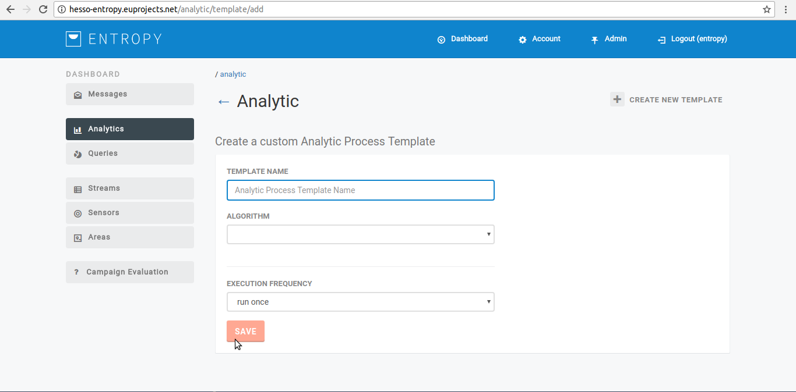

- You have successfully create new algorithm template.

**View an algorithm template**

- In order to view an algorithm template several consecutive steps have to be undertaken .
- Initially the user must login.

.. image:: assets/ENTROPY_cmdash.png

- Click on "Analytics" menu-item.

- Click on "Templates" button.

- Click on "VIEW" button.

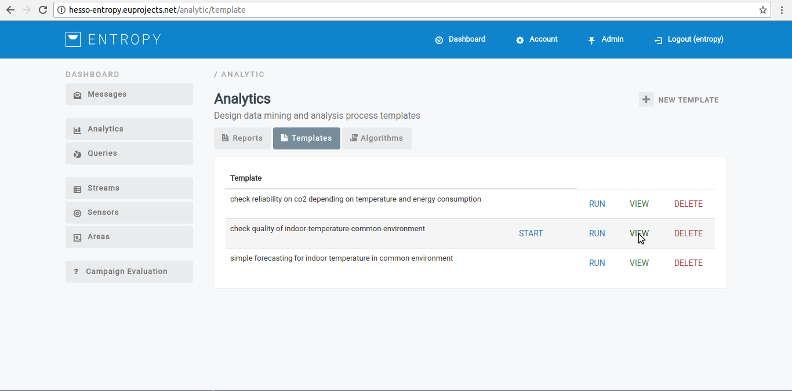

- The registered algorithm template appears in the platform.

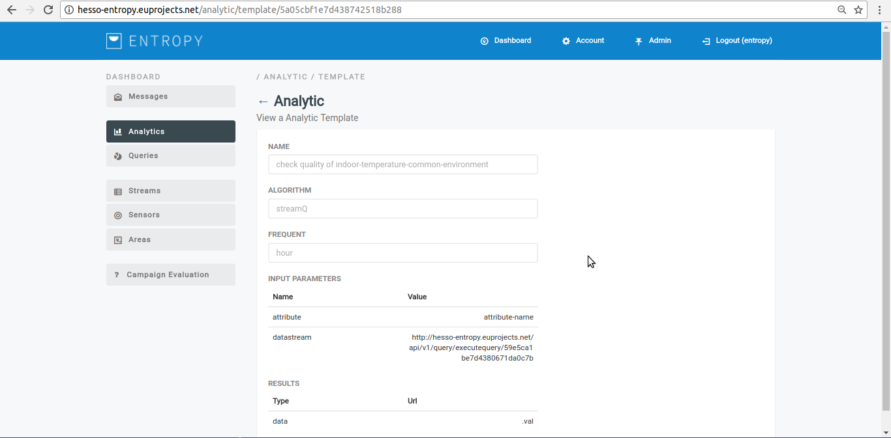

**Delete an algorithm template**

- In order to delete an algorithm template several consecutive steps have to be undertaken .
- Initially the user must login.

.. image:: assets/ENTROPY_cmdash.png

- Click on "Analytics" menu-item.

- Click on "Templates" button.

- Click on DELETE button.

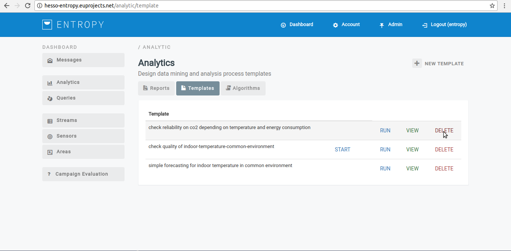

- You have successfully delete the selected algorithm template.

**Execute an algorithm template**
 
- In order to execute an algorithm template several consecutive steps have to be undertaken .
- Initially the user must login.

.. image:: assets/ENTROPY_cmdash.png

- Click on "Analytics" menu-item.

- Click on "Templates" button.

- Click on RUN button.

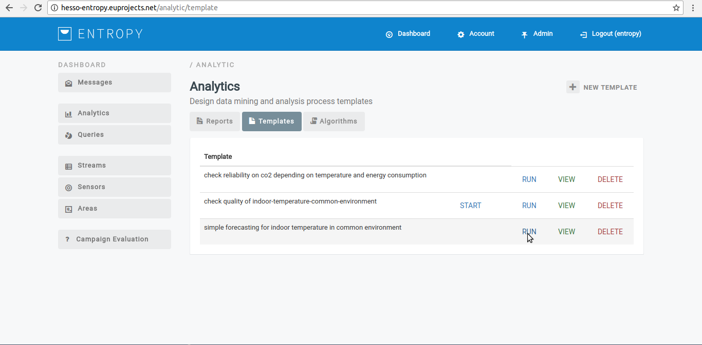

- You have successfully execute the selected algorithm template.

Analytic process
------------------

**View an analytic process**
 
- In order to view an algorithm template several consecutive steps have to be undertaken .
- Initially the user must login.

.. image:: assets/ENTROPY_cmdash.png

- Click on "Analytics" menu-item.

- Click on "Reports" button.

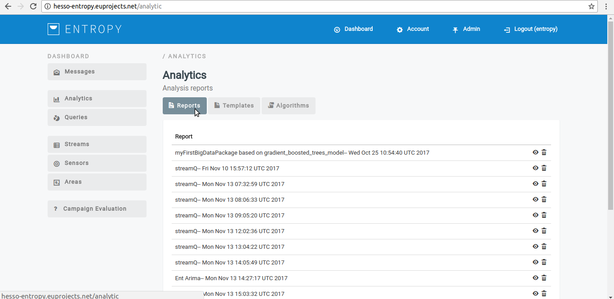

- Click on View button(eye object).

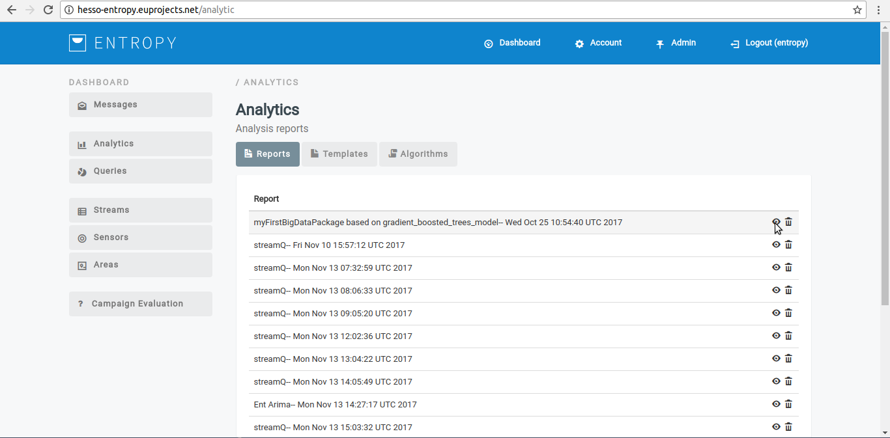

- The analytic process results appear in platform.

.. image:: assets/ENTROPY_vat_3.png

**Delete an analytic process**

- In order to delete  an analytic process several consecutive steps have to be undertaken .
- Initially the user must login.

.. image:: assets/ENTROPY_cmdash.png

- Click on "Analytics" menu-item.

- Click on "Reports" button.

- Click on DELETE button(Bin object).

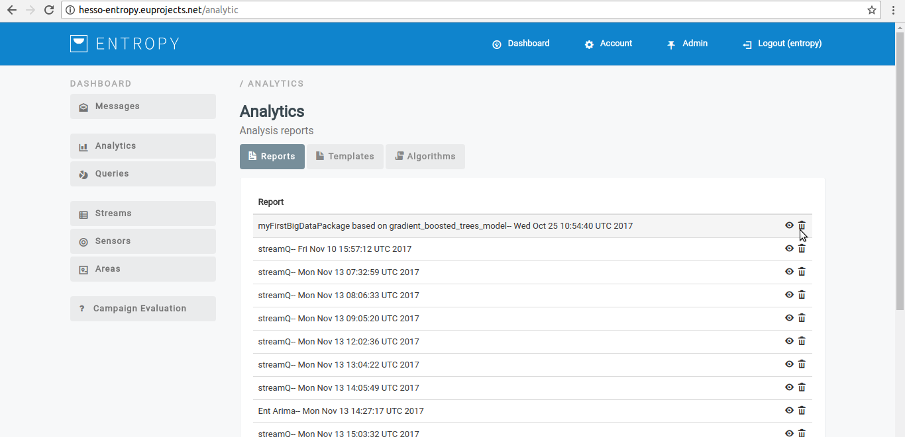

- You have successfully delete the selected analytic process.
