========
Messages
========

View list of generated recommendation messages
------------

- In order to view the list of generated recommendation messages  several consecutive steps have to be undertaken .
- Initially the user must login.

.. image:: assets/ENTROPY_cmdash.png

- Click on "Messages" menu-item.

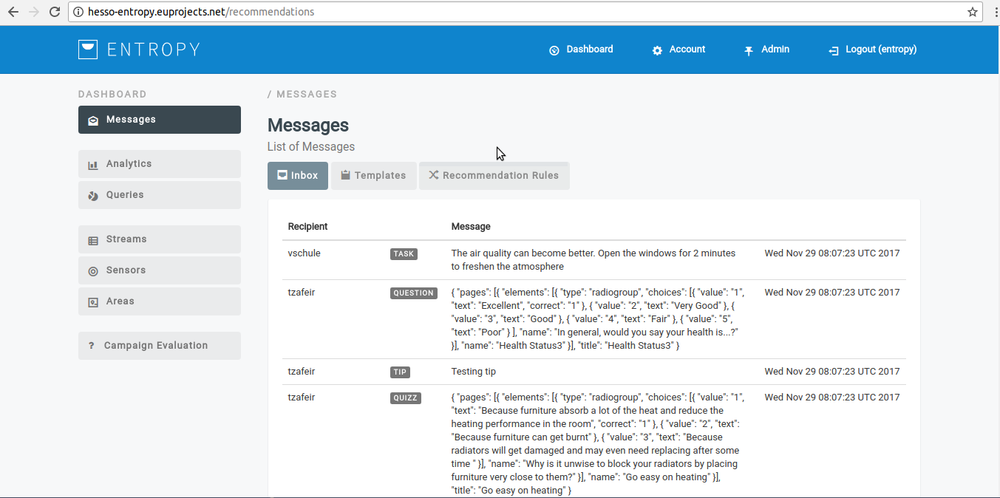

- The generated recommendation messages appear in platform.

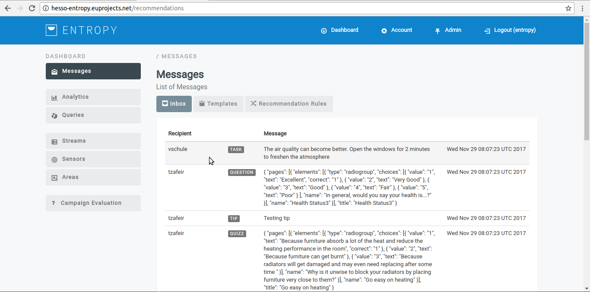

Recommendation Template
----------------------------------------

**Create a new recommendation Template**

- In order to create a new recommendation template several consecutive steps have to be undertaken .
- Initially the user must login.

.. image:: assets/ENTROPY_cmdash.png

- Click on "Messages" menu-item.

- Click on "Templates" button.

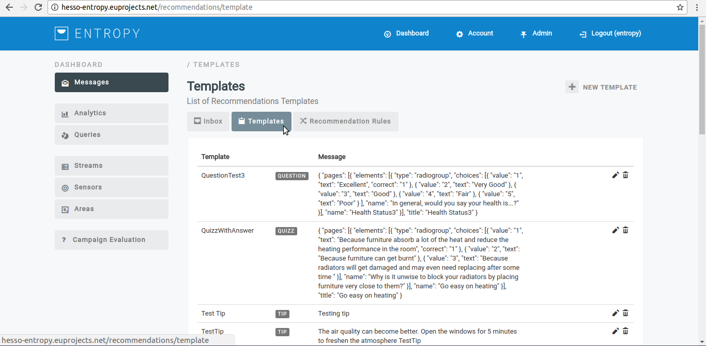

- Click on "New Template" button.

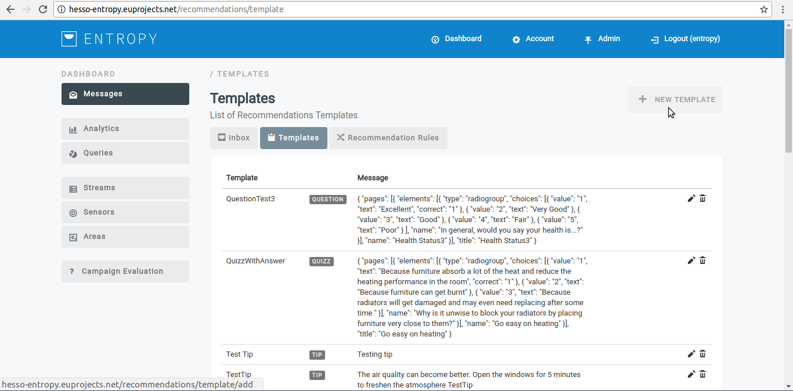

- Provide recommendation template details such us (friendly name,type,message, etc.)

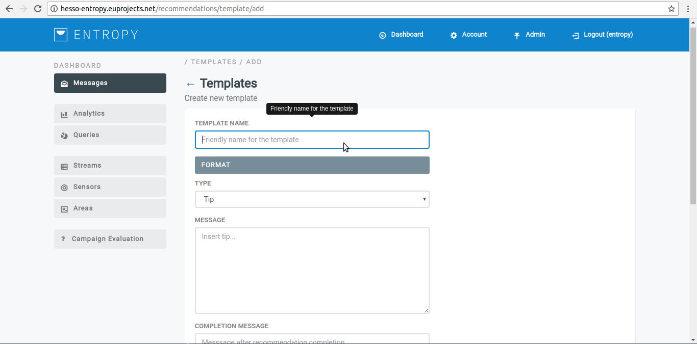

- Click on "SAVE" button.

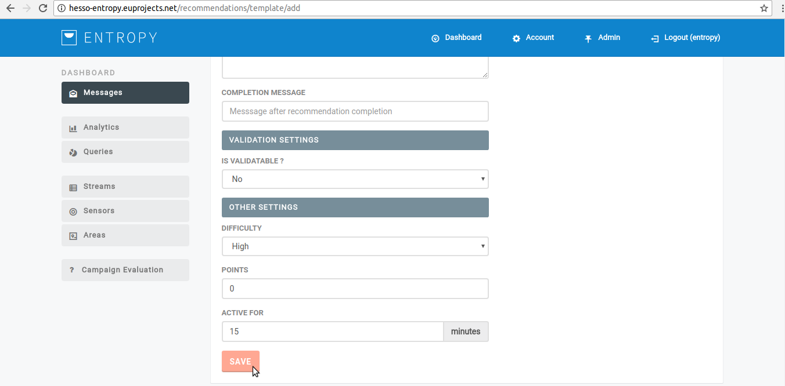

- You have successfully create a new recommendation template.

**Edit a recommendation Template**

- In order to edit a recommendation template several consecutive steps have to be undertaken .
- Initially the user must login.

.. image:: assets/ENTROPY_cmdash.png

- Click on "Messages" menu-item.

- Click on "Templates" button.

- Click on edit button(pencil object).

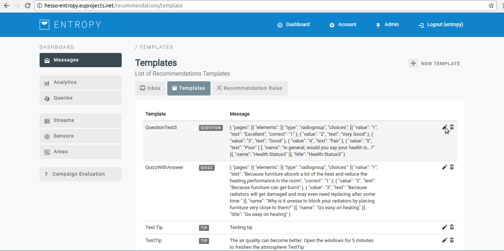

- Provide recommendation template details such us (friendly name,type,message, etc.)

.. image:: assets/ENTROPY_ert_2.png

- Click on "SAVE" button.

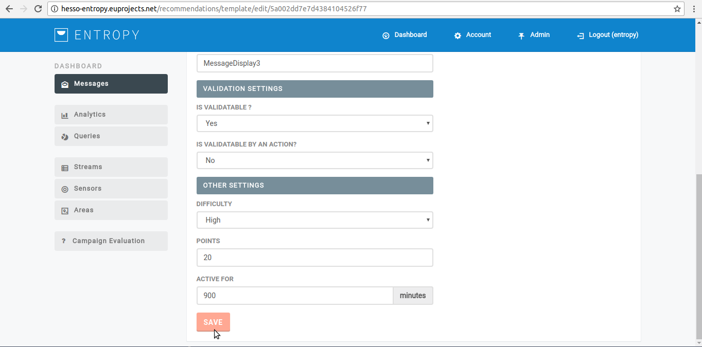

- You have successfully edit the selected recommendation template.

**Delete a recommendation Template**

- In order to delete a recommendation template several consecutive steps have to be undertaken .
- Initially the user must login.

.. image:: assets/ENTROPY_cmdash.png

- Click on "Messages" menu-item.

- Click on "Templates" button.

- Click on delete button(bin object).

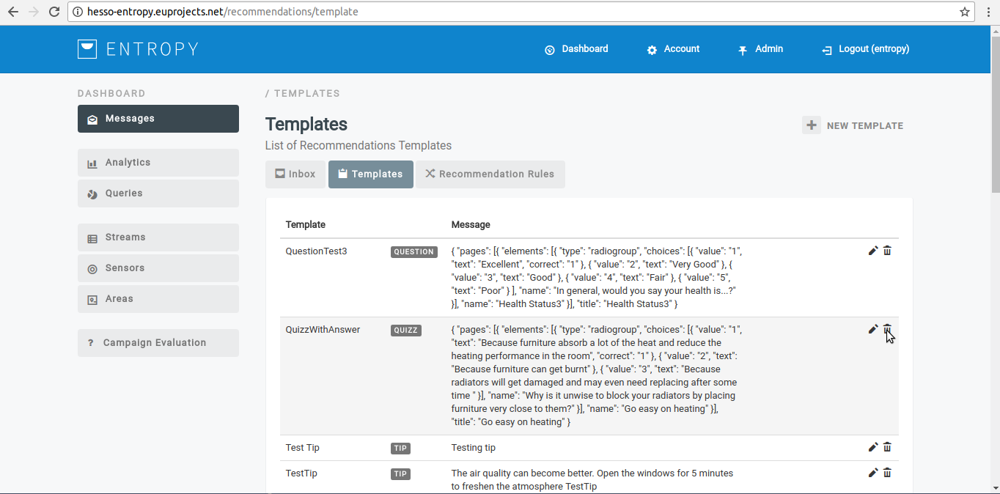

- You have successfully delete the selected recommendation template.

**View list of recommendation Template**

- In order to view a recommendation template list several consecutive steps have to be undertaken .
- Initially the user must login.

.. image:: assets/ENTROPY_cmdash.png

- Click on "Messages" menu-item.

- Click on "Templates" button.

- The recommendation template list appear in platform.

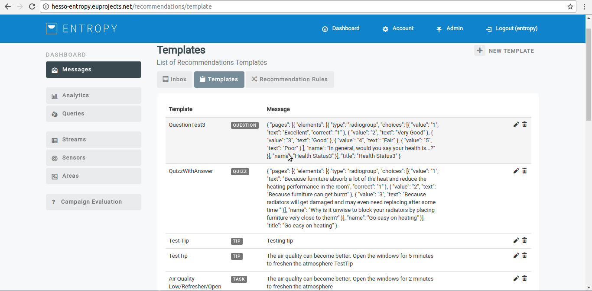

Recommendation Rule
----------------------------------------

**Create a new Recommendation Rule**

- In order to create a new recommendation rule several consecutive steps have to be undertaken .
- Initially the user must login.

.. image:: assets/ENTROPY_cmdash.png

- Click on "Messages" menu-item.

- Click on "Recommendation rules" button.

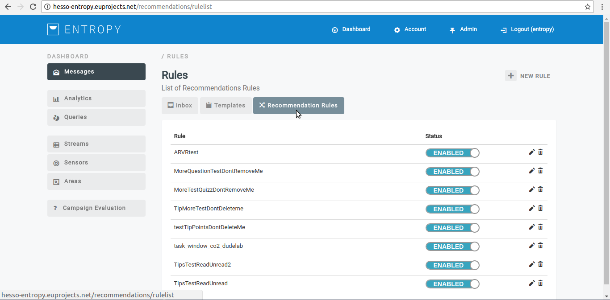

- Click on "New Rule" button.

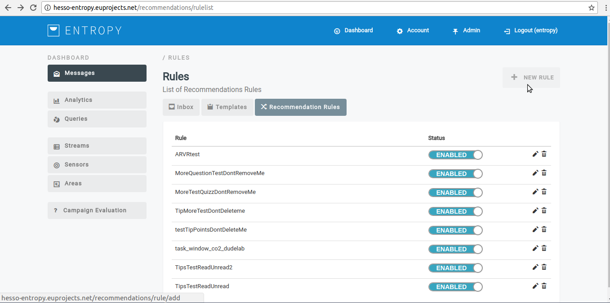

- Provide rules details such us (description,target users,etc.)

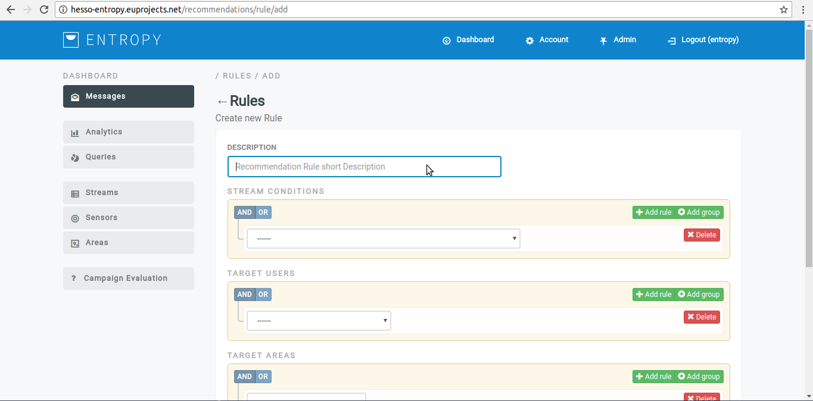

- Click on "SAVE" button.

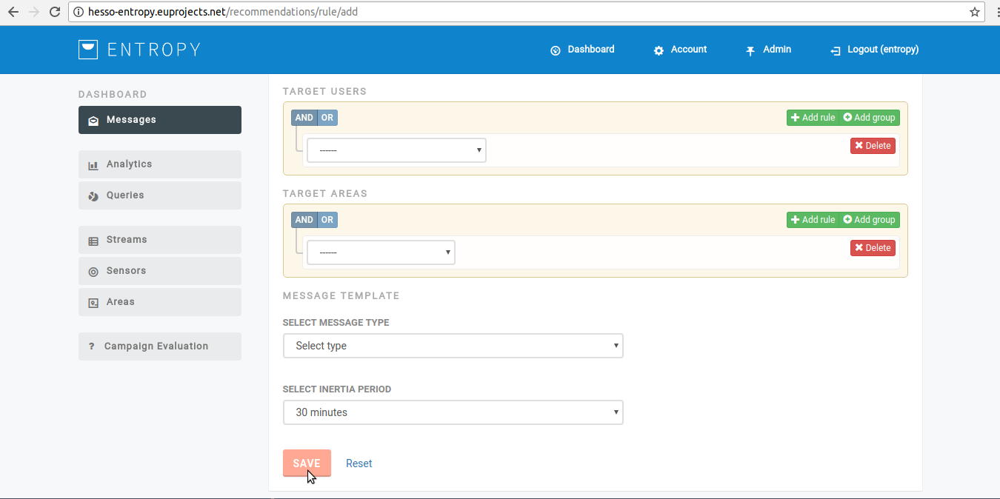

- You have successfully create a new recommendation rule.

**Edit a Recommendation Rule**

- In order to edit a recommendation rule several consecutive steps have to be undertaken .
- Initially the user must login.

.. image:: assets/ENTROPY_cmdash.png

- Click on "Messages" menu-item.

- Click on "Recommendation rules" button.

- Click on edit button(pencil object).

- Provide rules details such us (description,target users,stream conditions,etc.)

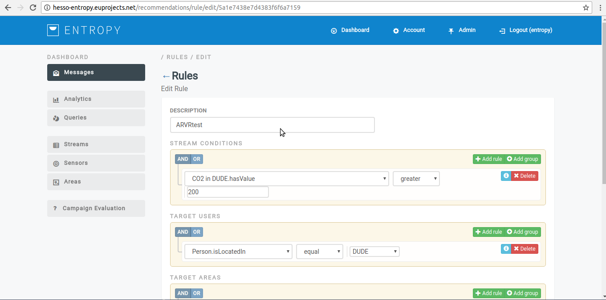

- Click on "UPDATE" button.

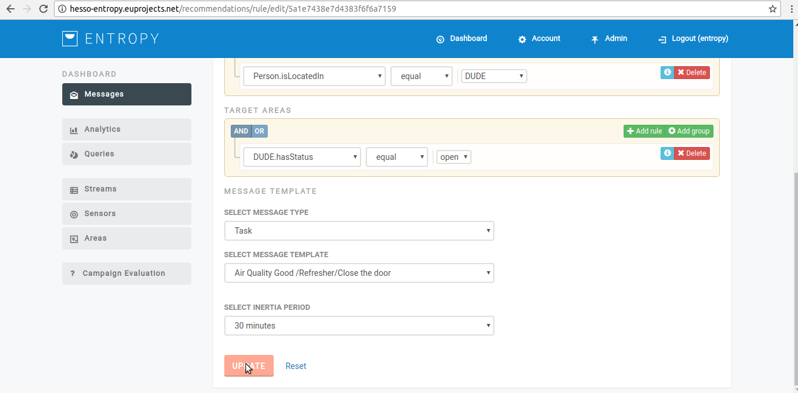

- You have successfully update a recommendation rule.

**Delete a Recommendation Rule**

- In order to edit a recommendation rule several consecutive steps have to be undertaken .
- Initially the user must login.

.. image:: assets/ENTROPY_cmdash.png

- Click on "Messages" menu-item.

- Click on "Recommendation rules" button.

- Click on delete button (bin object)

- You have successfully delete a recommendation rule.

**Enable/Disable a Recommendation Rule**

- In order to Enable/Disable a Recommendation Rule several consecutive steps have to be undertaken .
- Initially the user must login.

.. image:: assets/ENTROPY_cmdash.png

- Click on "Messages" menu-item.

- Click on "Recommendation rules" button.

- Slide the bar to the left in order to disable a recommendation rule.

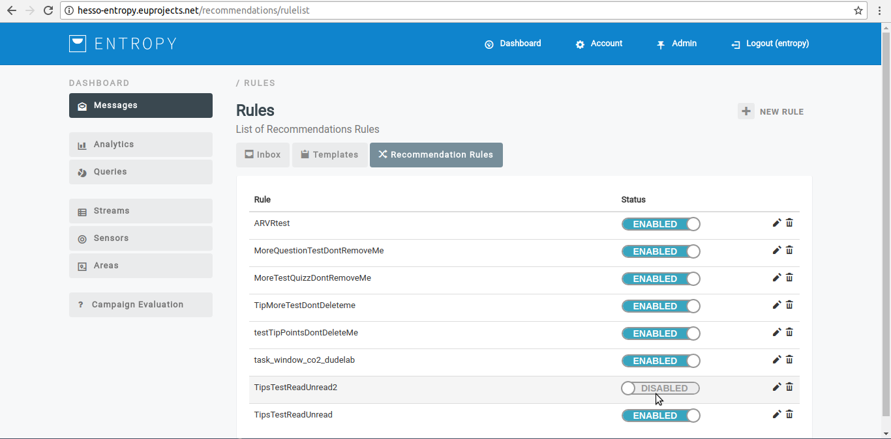

- Slide the bar to the right in order to enable a recommendation rule.

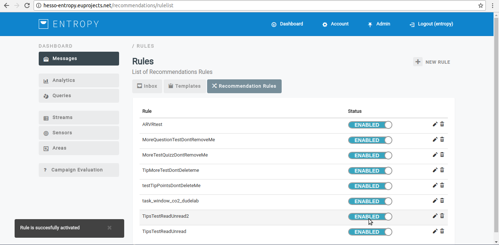
