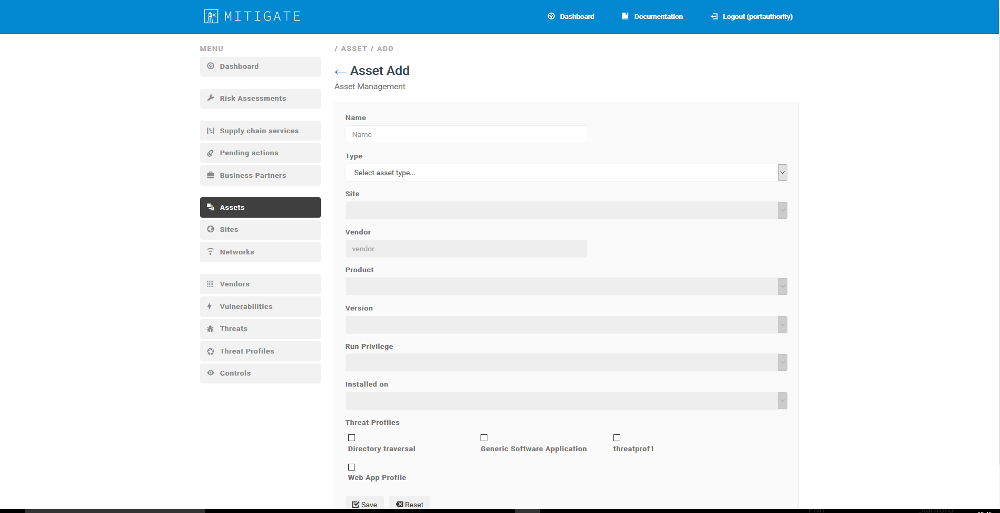
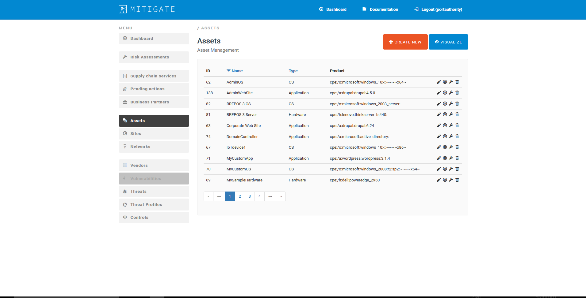
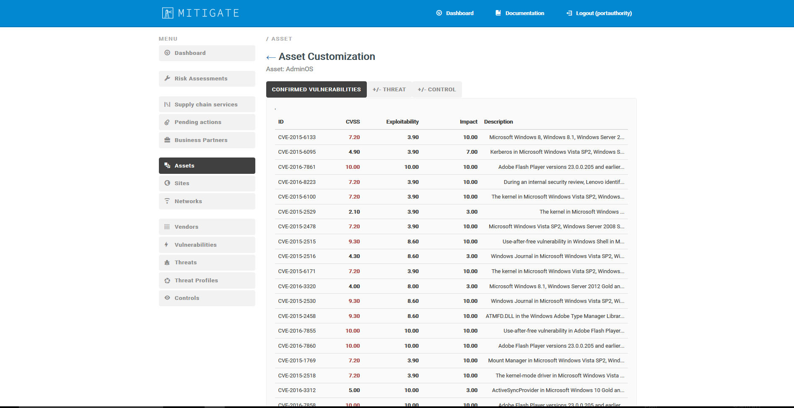
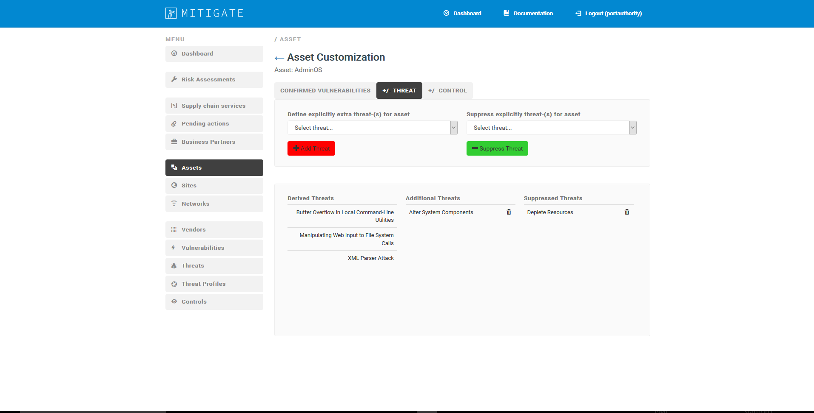

========
Asset Management 
========

Add an Asset and assosiate it to a threat profile.
------------
- In order to declare a new Asset several consecutive steps have to be undertaken .
- Initially the user must login.

.. image:: assets/Log_4.png

-  Select “Assets” on the menu bar on the left-hand side and click on “Create new” button. After a few seconds, the following page will appear. 

-  Fill in the required information:

**Name:** Provide the name of of the asset

**Type:** select the asset type (Application, Hardware or OS)

- **Application**

**Vendor**: select the vendor among the existing ones or add a new vendor (*Declare a new Vendor*).
.
**Run privilege:** select the run privilege (Domain admin, Domain user, Local admin, local user).

**Installed on:** select if applicable.

- **Hardware**

**Vendor**: select the vendor among the existing ones or add a new vendor (*Declare a new Vendor*).

**Site:** select the site among the existing ones or add a new site (*Declare a new Site*).

**Installed on**: select if applicable.

- **OS**

**Vendor**: select the vendor among the existing ones or add a new vendor (*Declare a new Vendor*).

**Installed on**: select if applicable

- Select one of the existing threat profiles or create a new threat profile (Declare a new Threat profile).

- Then click on “Save”.

**MITIGATE platform** helps you to automatically inhere existing information of potential vulnerabilities / threats associated to that asset. If there are other vulnerabilities / threats known only by you or your organization, you can add them manually (*Create a zero-day Vulnerability;* *Declare a new Threat*).

**Note #1:** Firewall is considered “Hardware”.

**Note #2:** Software can be installed to another Software or OS.

Management of a Threat on a specific asset
----------------------------------------

- For every asset, you have the possibility to edit the threats associated to it. To do so, click “Assets” on the menu (left-hand side of the page) and select the specific asset from the list.

- Click on **“Customize”** (key icon) associated to the selected asset.

- In the **“Confirmed vulnerabilities”** view you can see all vulnerabilities associated to that asset.Each vulnerability has an ID, a CVSS (Common Vulnerability Scoring System) score, Exploitability level, Impact, and a brief Description.

- In the **“Threat”** view you can view all threat associated to the specific asset, divided in three categories: i) Derived Threats, ii) Additional Threats, and iii) Suppressed Threats. You can also add and/or suppress additional threats.
