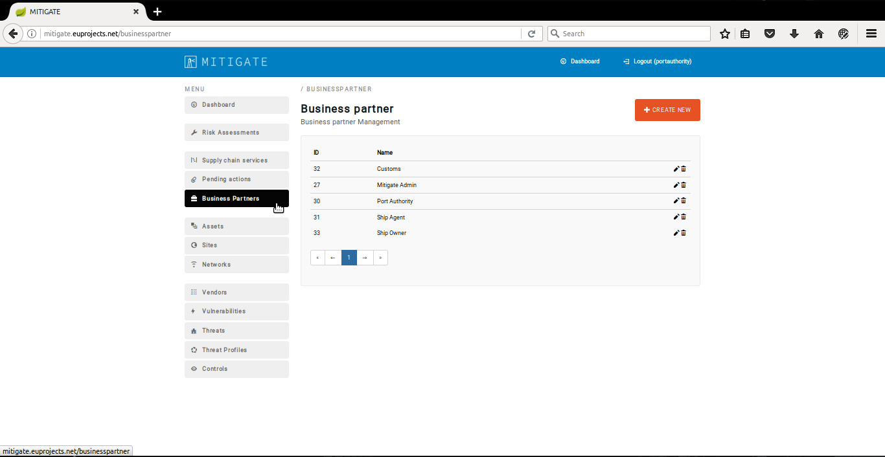
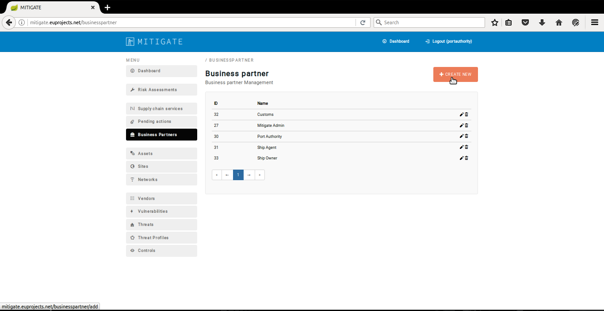
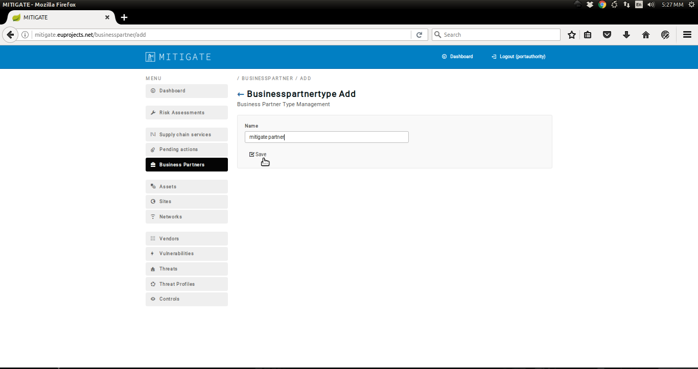
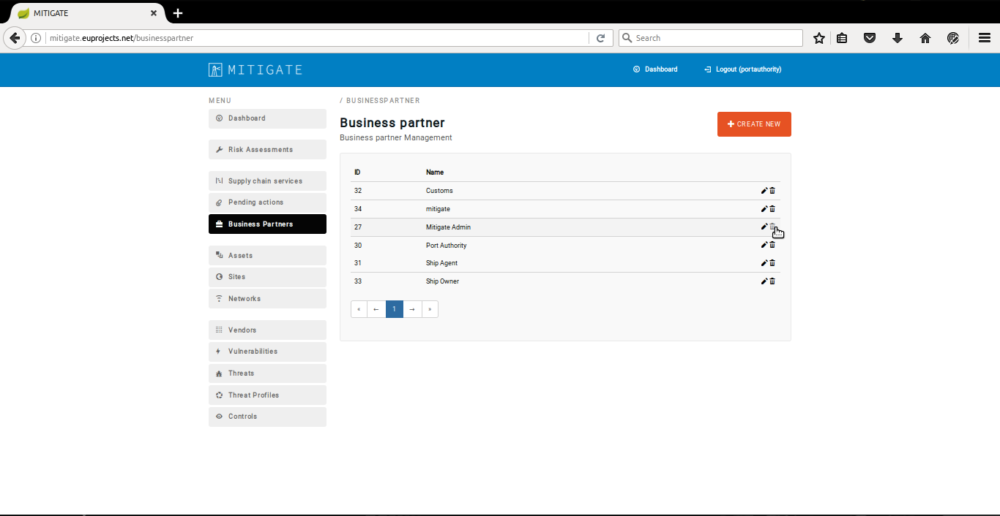
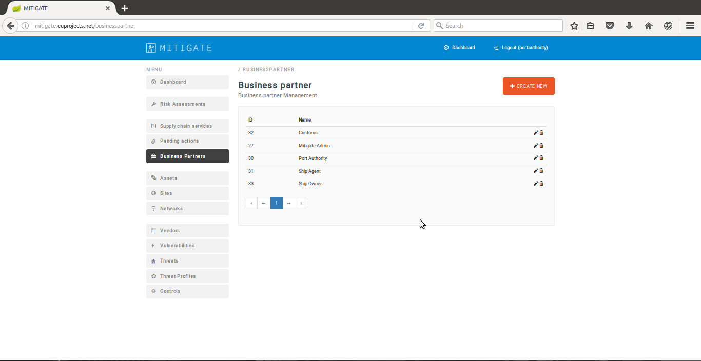

Campaigns
==========================

Create a new Campaign
--------------------------------------

- In order to declare a new Business partner several consecutive steps have to be undertaken .

- Initially the user must login.

.. image:: assets/Log_4.png

- Click on ‘’Business partners’’ menu-item.

- Click on “Create New” button.

- Provide Business partner details.

- Click on the “Save” button.

- Upon succesful declaration of the new business partner  the list of declare business partners  will be update it.

Edit a Campaign
--------------------------------------

- In order to edit a  Bussiness partner several consecutive steps have to be undertaken .

- Initially the user must login.

.. image:: assets/Log_4.png

- Click on ‘’Business partners’’ menu-item.

- Press the “edit” button.

.. image:: assets/ebp.png

- Upon succesful editing of the  business partner , the list of declare business partners  will be update it.

Delete a Campaign
--------------------------------------

- In order to delete a Bussiness partner several consecutive steps have to be undertaken .

- Initially the user must login.

.. image:: assets/Log_4.png

- Click on ‘’Business partners’’ menu-item.

- Press on “delete” button on the desired threat.

- Upon successful deleting of a business partner the list of business partners will be update it.

View a Campaign
--------------------------------------
