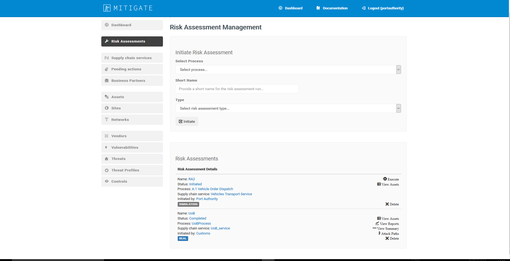
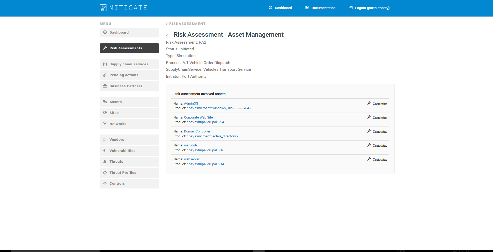
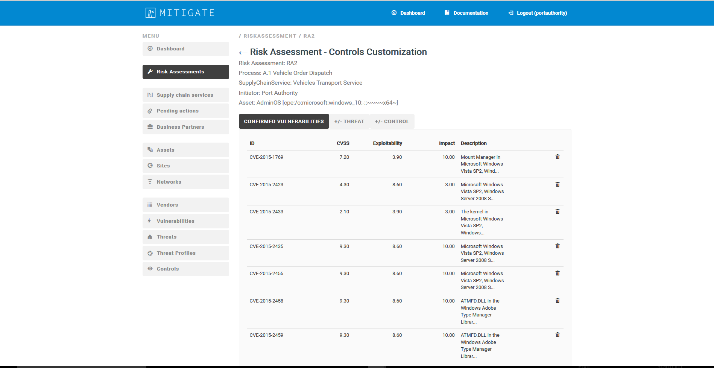
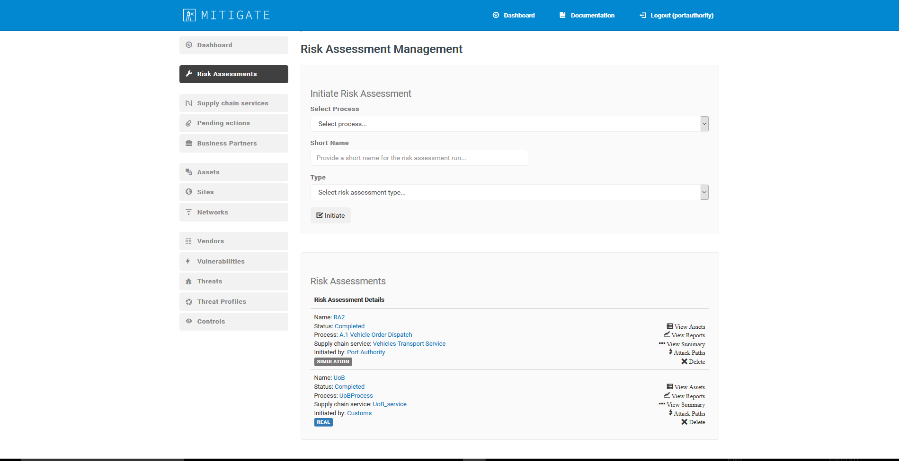
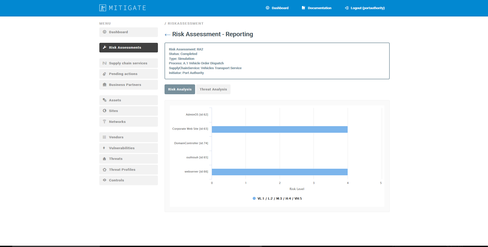
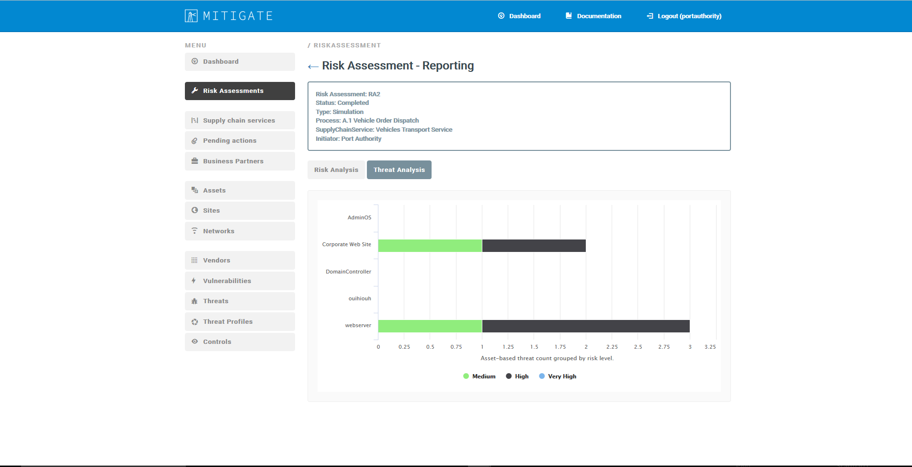
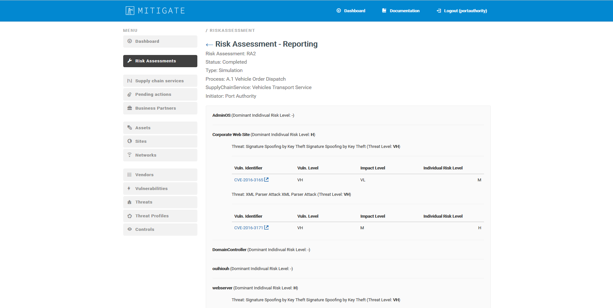
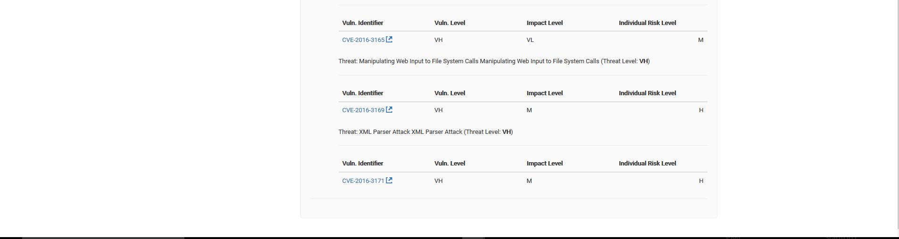
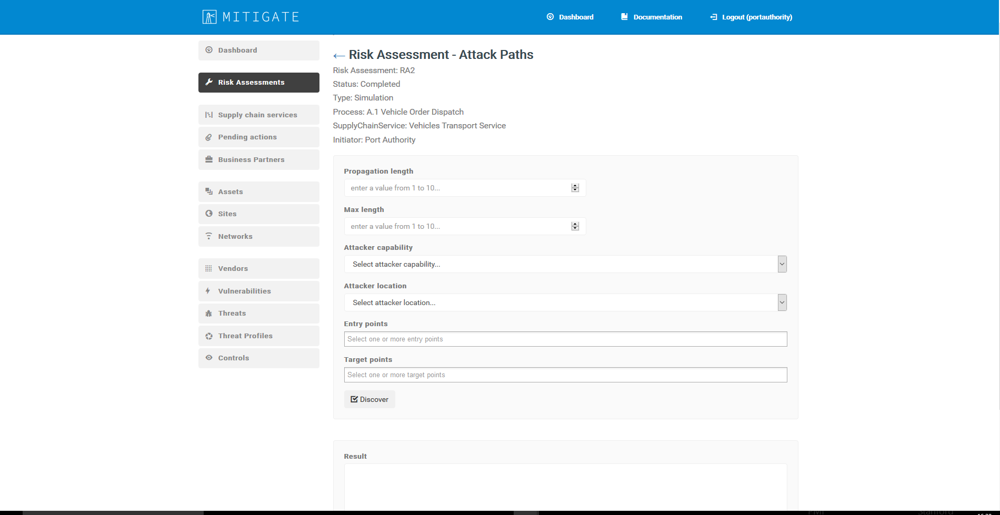

Risk assessment 
========

Initiate a Risk Assessment
--------

- To initiate a Risk Assessment select “Risk Assessments” tab on the menu bar and fill in the required information.
          
          -   **Process:** select the SCS process form the list (e.g. Vehicle Order Dispatch).
             
          -   **Short name:** provide a name for this Risk Assessment (e.g. RA1).
             
          -   **Type: select** the type of Risk Management to perform (Simulation and Real).

- Then press **“Initiate”**.

- If you have selected a Simulation, you can make any changes you deem necessary before to execute it.

- By clicking on “View assets” the system will show you the cyber assets participating in this SCS process. 

- As you may notice, you can edit all the one or more assets.

- You can edit the vulnerabilities / threats and controls associated to each asset.

- Once you have made all the changes, press the “Execute” button. The system will notify you that your Risk Assessment was successufully executed.

- You can now view the RA reports and the attack paths.

- **View Reports**

- Risk analysis report

- Threat Analysis report:

- Summary report:

- **View attack paths**

- To view the attack paths you need to select first the “Propagation lenght”, which is the maximum number of assets the attacker can exploit to reach any asset in the vicinity, and the “Maximum lenght”, which is the maximum number of assets the attacker can exploit in order to reach the target asset. Also, the attacker capability along with his/her location have to be selected. Finally, you have to indicate the “Entry points”, which is the asset that is going to be used by the attacker as the first attack point, and the “Target points”, which is the target asset of the attacker.
Once the information is completed, you can then press “Discover” button to view the attack paths in the panel below.

